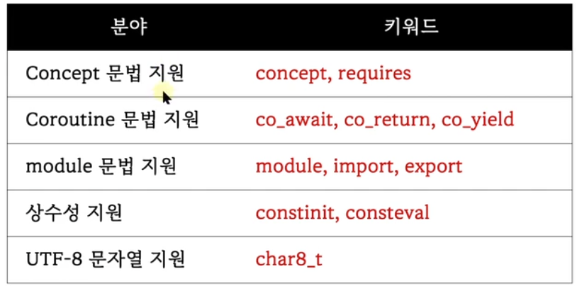
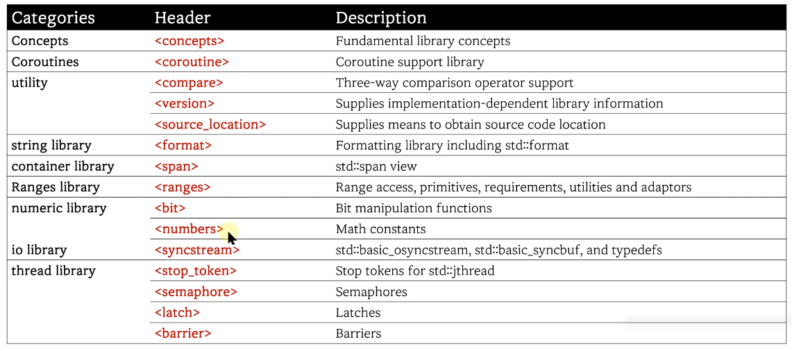
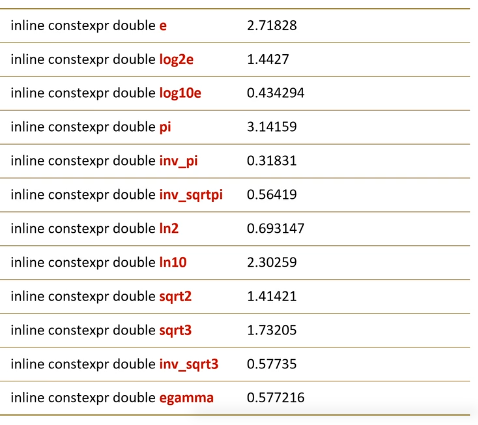

 
 # 1. C++20에서 추가된 새로운 키워드

 


# 2. C++20에서 추가된 헤더 파일



# 3. `numbers` header
- 수학관련 다양한 상수 값 제공
- `std::numbers` namespace


 ```c++
#include <iostream>
#include <numbers>

int main()
{
	std::cout << std::numbers::pi << std::endl;		// 3.14159
	std::cout << std::numbers::e << std::endl;		// 2.71828
	std::cout << std::numbers::sqrt2 << std::endl;	// 1.41421
}

 ```

 # 4. feature test macro
 ## c++20의 변화
 - 언어(문법)의 추가 및 변화
 - 라이브러리 STL의 추가

## feature test macro
- 현재 사용중인 `컴파일러가 특정 문법 또는 특정 라이브러리를 지원하는지 확인`하기 위해 사용
- 라이브러리 특성 조사는 연관된 헤더 파일 필요
- 매크로 값은 `버전(년도)`로 정의됨
- 표준 문서 또는 인터넷(cppreference.com) 참고

```c++
#include <iostream>
#include <span>
#include <chrono>

int main()
{
    // 언어 특징 지원 여부 조사
#ifdef __cpp_concepts
	std::cout << "support concepts" << std::endl;
#endif
#ifdef __cpp_modules
	std::cout << "support modules" << std::endl;
#endif
    // 라이브러리 특징 지원 여부 조사 - 관련된 헤더 필요
#ifdef __cpp_lib_span
	std::cout << "support span lib" << std::endl;
#endif
#ifdef __cpp_lib_chrono
	std::cout << "support chrono lib" << std::endl;
    std::cout << "chrono version : " << __cpp_lib_chrono << std::endl;
#endif   
}
```