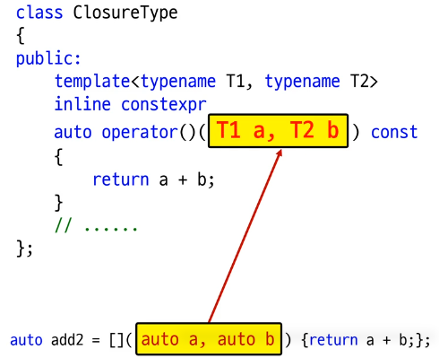

# 1. C++20에서 추가된 람다 표현식의 특징
- 람다표현식에서 `템플릿 사용 가능`
- `평가되지 않는 표현식`에서 람다 표현식 사용 가능
- 캡쳐하지 않은 람다 표현식에서 `디폴트 생성자와 대입 연산자 사용` 가능
- `암시적인 this 캡쳐가 deprecated`됨
- `parameter pack 캡쳐` 가능

# 2. template in lambda expression
## Generic lambda expression
- C++14부터 람다 표현식의 인자로 `auto` 사용 가능
- Generic lambda expression의 원리


```c++
#include <iostream>

auto add1 = [](int  a, int  b) {return a + b;};
auto add2 = [](auto a, auto b) {return a + b;};

auto add3 = [](auto a, decltype(a) b) {return a + b;};
//              int a, int b
int main()
{
    std::cout << add1(1,   2)   << std::endl; // 3
    std::cout << add1(1.1, 2.2) << std::endl; // 3

    std::cout << add2(1,   2)   << std::endl; // 3
    std::cout << add2(1.1, 2.2) << std::endl; // 3.3
    std::cout << add2(1,   2.2) << std::endl; // 3.2

    std::cout << add3(1,   2)   << std::endl; // 3
    std::cout << add3(1.1, 2.2) << std::endl; // 3.3
    std::cout << add3(1,   2.2) << std::endl; // 3
}

```

## 2개 인자가 같은 타입만 사용하게 제약할수 없을까?
- swap 등의 함수는 동일 타입에 대해서만 동작하게 만드는 것이 좋다.

```c++
#include <iostream>

auto add1 = [](auto a, auto b) {return a + b;}; // C++14
auto add2 = []<typename T>(T a, T b) {return a + b;}; // C++20

auto add3 = []<typename T1, typename T2>(T1 a, T1 b, T2 c) {return a + b + c;}; // C++20

int main()
{
    std::cout << add1(1,   2)   << std::endl; // 3
    std::cout << add1(1.1, 2.2) << std::endl; // 3.3
    std::cout << add1(1,   2.2) << std::endl; // 3.2

    std::cout << add2(1,   2)   << std::endl; // 3
    std::cout << add2(1.1, 2.2) << std::endl; // 3.3
//    std::cout << add2(1,   2.2) << std::endl; // error.

//   std::cout << add2<int>(1,   2.2) << std::endl; // error.

//   add2.operator()(1, 2.2); // 람다 표현식은 결국 () 연산자 호출
   add2.operator()<int>(1, 2.2); // ok


}

```