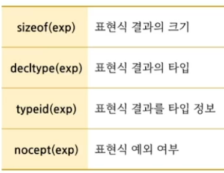
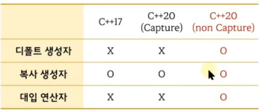

# 1. C++20에서 추가된 람다 표현식의 특징
1) 람다표현식에서 `템플릿 사용 가능`
2 `평가되지 않는 표현식`에서 람다 표현식 사용 가능
3) 캡쳐하지 않은 람다 표현식에서 `디폴트 생성자와 대입 연산자 사용` 가능
4) `암시적인 this 캡쳐가 deprecated`됨
5) `parameter pack 캡쳐` 가능


# unique_ptr 의 삭제자 변경
- 템플릿 2번째 인자로 `삭제 방식을 담은 함수 객체`를 전달한다.

```c++
#include <iostream>
#include <memory>

struct Freer
{
    inline void operator()(void* p) const noexcept
    {
        std::cout << "free" << std::endl;
        free(p);
    }
};

int main()
{
    std::unique_ptr<int> up1( new int ); // delete
 
    //std::unique_ptr<int, Freer> up2( static_cast<int*>( malloc(100) ) );

    //std::unique_ptr<int, [](int* p) {free(p);} > up2( static_cast<int*>( malloc(100) ) );

    std::unique_ptr<int, decltype([](int* p) {free(p);}) > up2( static_cast<int*>( malloc(100) ) );

}
```

# 평가되지 않는 표현식(unevaluated expression)
- 실행 시간에는 `실행되지 않고, 컴파일 시간에만 사용`되는 표현식
- 4개의 평가되지 않는 표현식이 있다.

- C++17 까지는 평가되지 않는 표현식에서 `람다 표현식`을 사용할수 없다.
- `C++20부터는 람다표현식 사용 가능`

```c++
#include <iostream>
#include <memory>

int add(int a, int b); // { return a + b;}

int main()
{
    std::cout << sizeof(int)  << std::endl;  // 4

    // sizeof(함수호출식) : 리턴 타입의 크기
    std::cout << sizeof( add(1, 2) ) << std::endl; // 4

    decltype( add(1,2) ) n;  // int n

    std::cout << sizeof( [](int a, int b) {return a + b;} ) << std::endl;  // C++17.. error. C++20 ok
                            // 1

    std::cout << sizeof( [](int a, int b) {return a + b;}(1,2) ) << std::endl; // 4

    std::unique_ptr<int, decltype( [](int* p) { delete p; }) > up( new int );
}
```

# 람다 표현식과 디폴트 생성자


```c++
#include <iostream>

int main()
{
    int v1 = 10;

    auto f1 = [v1](int a, int b) {return a + b;};

                            // C++11 ~ C++17     C++ 20
    decltype(f1) f2;        // Error               Error
    decltype(f1) f3 = f1;   // OK                  OK
    f3 = f1;                // Error               Error

/*
    auto f1 = [](int a, int b) {return a + b;};

                            // C++11 ~ C++17     C++ 20
    decltype(f1) f2;        // Error               OK
    decltype(f1) f3 = f1;   // OK                  OK
    f3 = f1;                // Error               OK
*/
   
}
```

```c++
#include <iostream>

template<typename T, typename D> class unique_ptr
{
    T* obj;
 //   D d;
public:
    explicit unique_ptr(T* p = 0) : obj(p) {}

    ~unique_ptr()
    {
        D d;  // 디폴트 생성자 필요. C++17 error
              // C++20. ok
        d(obj);
    }
};

int main()
{
    //unique_ptr<int, decltype([](int* p){delete p;}) > p1(new int);

    auto f = [](int* p){delete p;};

    unique_ptr<int, decltype(f) > p1(new int); // C++11도 ok..
}
```