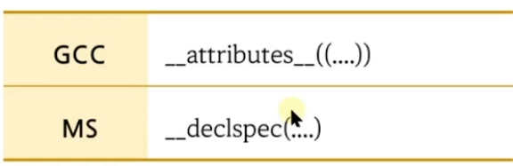
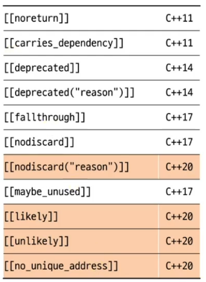
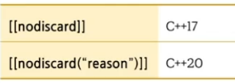

# 1. Attributes
- C++11에서 추가된 문법
- 컴파일러 지시문
- 형태

- 표준이 나오기 전에는 컴파일러마다 다른 방식으로 사용

- C++ 표준



```c++
#include <thread>
#include <future>

int foo() { return 0; }

[[nodiscard("memory leak may occur.")]] int* allocate(int size)
{
    return new int[size];
}

int main()
{
    int* p = allocate(10);

//    std::future<int> ret = 
    std::async(std::launch::async, foo);
    
}
```

# [[nodiscard]]
- encourages the compiler to issue `a warning if the return value is discarded`
- 함수, 생성자, enum 상수 등 여러 곳에 올수 있다.




```c++
struct MyType
{
    [[nodiscard]]  MyType(int n, bool b) {}
};

enum class [[nodiscard]] ErrorCode { OK, WARNING, CRITICAL, FATAL };

ErrorCode foo() { return ErrorCode::CRITICAL; }

int main()
{
    auto ret = foo();

    MyType t1 = MyType(1, true);
    
    MyType(1, true);
}

```

# [[likely]], [[unlikely]]
- 컴파일러 최적화에 관련된 attributes
- 제어문 등을 만들때 `특정 조건이 발생할 확률이 더 높다`는 것을 알려주는 것
- Linux kernel의 "__builtin_expect(i>0, 1)"

```c++
int foo(int i) 
{
//    if ( __builtin_expect(i>0, 1 ) )
    if  ( i >  0) [[likely]]
        i += 2; 
    else 
        i -= 2; 

    return i; 
} 

int main() 
{ 
    foo(10);

    return 0; 
}
```