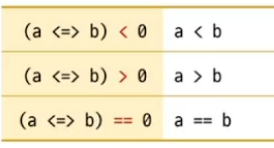
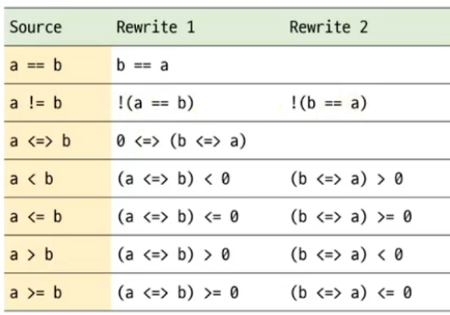

# Three-way Comparison

# 관계 연산자 (relational operator)
- 6개의 연산자(==, !=, <, <=, >, >=)

# Three-way comparision operator in C++20
- `<=>`
- `Spaceship operator` 이라고 불림
- 연산자의 의미
  
 

- `<=> 연산자`의 반환 타입
  - std::strong_ordering
  - std::weak_ordering
  - std::partial_ordering

# 사용자 정의 타입 "Int32"에 비교 연산을 지원하려면
- 모든 관계 연산자를 직접 구현하면 "18개의 함수를 제공"해야 한다.
- `<=>` 연산자를 사용하면 "4개의 함수(또는 3개의 함수)"만 제공하면 된다.
- `<=>` 연산자를 재정의 시는 `<compare> 헤더` 필요


```c++
#include <compare>

class Int32
{
    int value;
public:
    explicit Int32(int v = 0) : value(v) {}

//    friend bool operator<(const Int32& obj1, const Int32& obj2) { return obj1.value < obj2.value; }
//    friend bool operator<(const Int32& obj,  int n)             { return obj.value < n; }
//    friend bool operator<(int n,             const Int32& obj)  { return n < obj.value; }

    auto operator<=>(const Int32& other) const { return value <=> other.value;}
    bool operator== (const Int32& other) const { return value ==  other.value;}

    auto operator<=>(int other) const { return value <=> other;}
    bool operator== (int other) const { return value ==  other;}
};
int main()
{ 
    Int32 n1{10};
    Int32 n2{20};

    bool b1 = n1 < n2;  // operator<( Int32, Int32 )  또는 n1.operator<(Int32)
    bool b2 = n1 < 20;  // operator<( Int32, int)     또는 n1.operator<(int)
    bool b3 = 10 < n1;  // operator<( int, Int32) 만 가능. 멤버 함수로는 만들수 없다.

    bool b4 = 10 == n1;
}
```

# Rewrite Expression
- 사용자가 만든 표현식을 `컴파일 시간에 다시 작성`하는 개념

 


```c++
#include <compare>
class Int32
{
    int value;
public:
    explicit Int32(int v = 0) : value(v) {}    

    auto operator<=>(const Int32& other) const { return value <=> other.value;}
    bool operator== (const Int32& other) const { return value ==  other.value;}

    auto operator<=>(int other) const { return value <=> other;}
    bool operator== (int other) const { return value ==  other;}
};
int main()
{ 
    Int32 n1{10}, n2{20};

    bool b1 = n1 == n2; // n1.operator==(n2)
    bool b2 = n1 != n2; // !(n1 == n2)
    bool b3 = n1 < n2;  // (n1 <=> n2) < 0
    bool b4 = n1 > n2;  // (n1 <=> n2) > 0

    bool b5 = n1 < 10;  // (n1 <=> 10) < 0 
    bool b6 = 10 < n1;  // (10 <=> n1) < 0, =>  ( n1 <=> 10 ) > 0
}
```