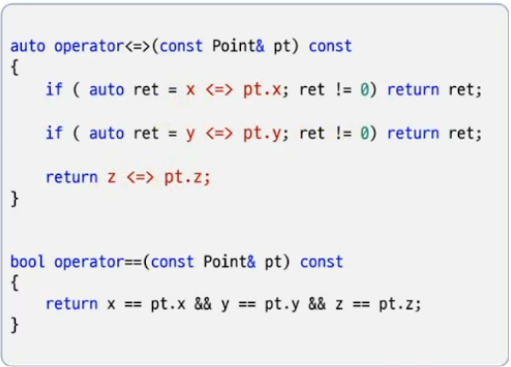

# Three-way Comparison

# Default implementation
- `<=>` 연산자를 `=default`로 지정
- `<=>와 == 연산자를 모두 자동 생성됨`
- default 구현은 `lexicalgraphical compare(멤버가 놓인 순서대로 비교)` 방식 사용



# 사용자가 직접 구현을 제공하는 경우
- `<=> 연산자와 == 연산자를 모두 구현`해야 한다.

```c++
#include <compare>

class Point3D
{
    int x;
    int y;
    int z;
public:
    Point3D( int x = 0, int y = 0, int z = 0) : x{x},y{y},z{z} {}

    //auto operator<=>(const Point3D& pt) const = default;

    auto operator<=>(const Point3D& pt) const 
    {
        return z <=> pt.z;
    }
    bool operator==(const Point3D& pt) const  = default;
};

int main()
{
    Point3D p1{1,2,3}, p2{3,2,1};

    bool b1 =  p1 == p2;
    bool b2 =  p1 <  p2;
    bool b3 =  p1 <= p2;
    auto ret = p1 <=> p2;
}
```

# <=> 연산자와 == 연산자
- 일부 타입의 경우 `상등 여부는 다양한 방식으로 최적화될수 있다.`

```c++
#include <compare>
#include <cstring>
class String
{
    char* buff;
    int   size;
public:
    String(const char* s) 
    {
        size = strlen(s);
        buff = new char[size + 1];
        strcpy(buff, s);
    }
    ~String() { delete[] buff;}
    auto operator<=>(const String& s) const {  return strcmp(buff, s.buff) <=> 0;   }

    bool operator==(const String& s) const
    {
        return size == s.size || (*this <=> s) == 0;
    }
};
int main()
{
    String s1("ABCD");
    String s2("ABCXYZ");
    bool ret = s1 == s2;
}
```

