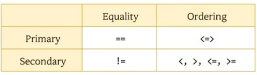
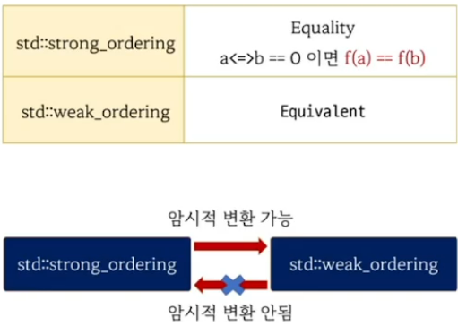
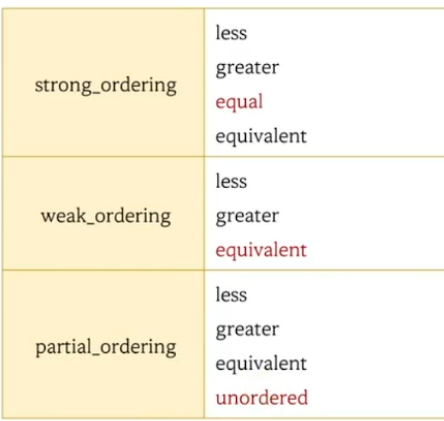

# <=> 연산자의 반환 타입
- std::strong_ordering
- std::weak_ordering
- std::partial_ordering



# <=> 연산자의 반환 타입



```c++
#include <iostream>
#include <compare>

struct Rect
{
    int x, y, w, h;
    Rect(int x, int y, int w, int h) : x{x}, y{y}, w{w}, h{h} {}
    
    // 사각형의 크기 비교..
    //std::strong_ordering operator<=>(const Rect& r) const 
    std::weak_ordering operator<=>(const Rect& r) const 
    { 
        // return std::strong_ordering 
         return (w*h) <=> (r.w * r.h); 
    }
};

int square(int a) { return a * a;}

int main()
{
    Rect r1(1, 1, 5, 2);
    Rect r2(1, 1, 2, 5);

    auto ret = r1 <=> r2;

    if ( ret == std::strong_ordering::equal )
    {
        // r1, r2 동일하다는 가정하의 알고리즘 작성
    }


    if ( ret == 0)
    {

    }


    int n1 = 10, n2 = 10;

    if ( (n1 <=> n2) == 0 ) // equality ( 동일 )
    {
        assert( square(n1) == square(n2) );
    }
} 
```  


```c++
#include <iostream>
#include <string>

struct People
{
    std::string name;
    int         age;
    People( std::string n, int a) : name(n), age(a) {}
   
    std::partial_ordering operator<=>(const People& p) const 
    {
        if ( age < 1 || p.age < 1 ) return std::partial_ordering::unordered;
        return age <=> p.age;
    }
};
int main()
{
    People p1("Kim", 20);
    People p2("Lee", -10);

    auto ret = (p1 <=> p2);

    if ( ret == std::partial_ordering::unordered ) 
    {
        std::cout << "can not ordered" << std::endl;
    }

    auto ret2 = ( 3.4 <=> 2.1 ); // NaN => Not A Numbder

    std::cout << typeid(ret2).name() << std::endl;

}
```

# <=> 연산자의 반환 타입
 


- int <=> int  : std::strong_ordering
- double <=> double  : std::partial_ordering


