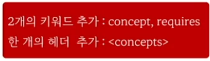

# concept
- 타입이 가져야하는 요구 조건을 정의하는 문법
- "Named sets of requirements"
- 사용자가 만들수도 있고, C++표준 Concept로 제공

# Requires Clauses(절, 항목, 조항)
- 템플릿 인자가 가져야 하는 조건을 표기하는 문법
- 조건을 만족하는 경우에만 템플릿 사용
- Concept 뿐 아니라 type traits 등도 사용 가능


```c++
#include <concepts>

template<typename T>
concept GreaterThan4 = sizeof(T) >= 4;

template<typename T> requires GreaterThan4<T>
void foo(T arg)
{

}
int main()
{
    int i = 10;
    short s = 10;
    double d = 3.4;

    foo(i);  // ok
    foo(s);  // error
    foo(d);  // ok
}
```

# 알아야 하는 것들
1) Concept을 만드는 방법
2) C++ 표준 concept
3) Requires Clauses 문법

