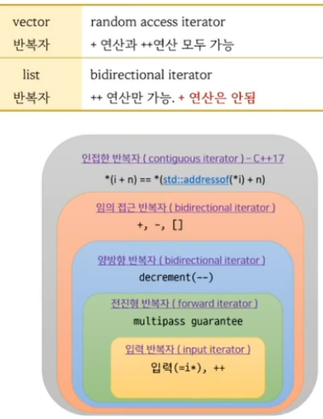

```c++
#include <iostream>

template<typename T> 
concept Concept1 = sizeof(T) > 1;

template<typename T>   
concept Concept2 = sizeof(T) > 1 && sizeof(T) < 8;

template<typename T> requires Concept1<T> 
void foo(T a) { std::cout << "1" << std::endl; }

template<typename T> requires Concept2<T>
void foo(T a) { std::cout << "2" << std::endl;}

int main()
{
    foo(3); // int
}
```

```c++
#include <iostream>

template<typename T> 
concept Concept1 = sizeof(T) > 1;

template<typename T>   
concept Concept2 = Concept1<T> && sizeof(T) < 8;

template<typename T> requires Concept1<T> 
void foo(T a) { std::cout << "1" << std::endl; }

template<typename T> requires Concept2<T>
void foo(T a) { std::cout << "2" << std::endl;}

int main()
{
    foo(3);
}
```

```c++
#include <iostream>

template<typename T> 
concept Concept1 = sizeof(T) > 1;

template<typename T> requires Concept1<T> 
void foo(T a) { std::cout << "1" << std::endl; }

template<typename T> requires Concept1<T> && ( sizeof(T) < 8 )
void foo(T a) { std::cout << "2" << std::endl;}

int main()
{
    foo(3);
}
```

```c++
#include <iostream>

template<typename T> 
concept Concept1 = sizeof(T) > 1;

template<typename T>   
concept Concept2 = sizeof(T) < 8;

template<typename T>   
concept Concept3 = Concept1<T> && Concept2<T>;

template<typename T> requires Concept1<T> 
void foo(T a) { std::cout << "1" << std::endl; }

template<typename T> requires Concept3<T>
void foo(T a) { std::cout << "2" << std::endl;}

int main()
{
    foo(3);
}
```

# 반복자 카테고리
- 반복자가 수행할수 있는 연산의 종류에 따른 구분


```c++
#include <vector>
#include <list>
#include <iostream>

template<typename T> requires std::input_iterator<T>
void advance(T p, int N)
{
    std::cout << "input_iterator" << std::endl;
    while(N--) ++p;
}

template<typename T> requires std::random_access_iterator<T>
void advance(T p, int N)
{
    std::cout << "random_access_iterator" << std::endl;
    p = p + N;
}

int main()
{
    std::vector<int> c = {1,2,3,4,5,6,7,8,9,10};
//    std::list<int> c = {1,2,3,4,5,6,7,8,9,10};

    auto p = c.begin();

    // 반복자를 3칸 전진하고 싶다.
    // p = p + 3; // ++p; ++p; ++p;
    //std::advance(p, 3);
    advance(p, 3);
} 
```