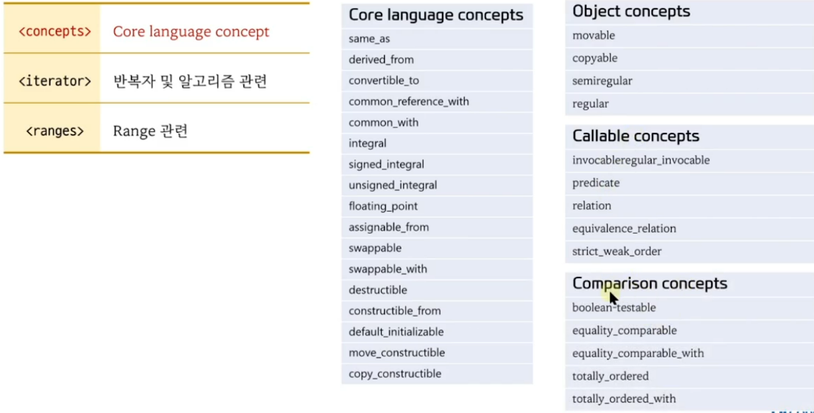
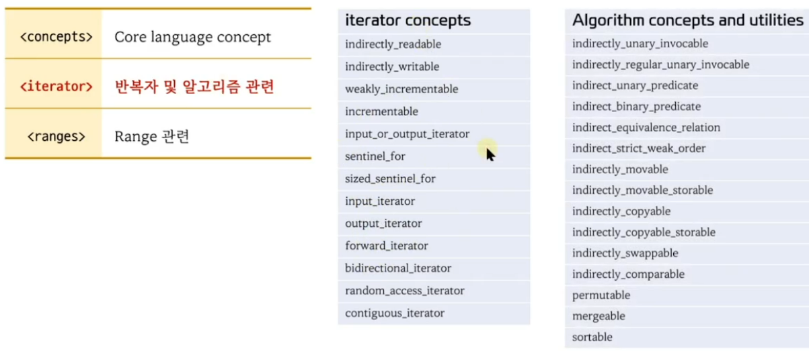
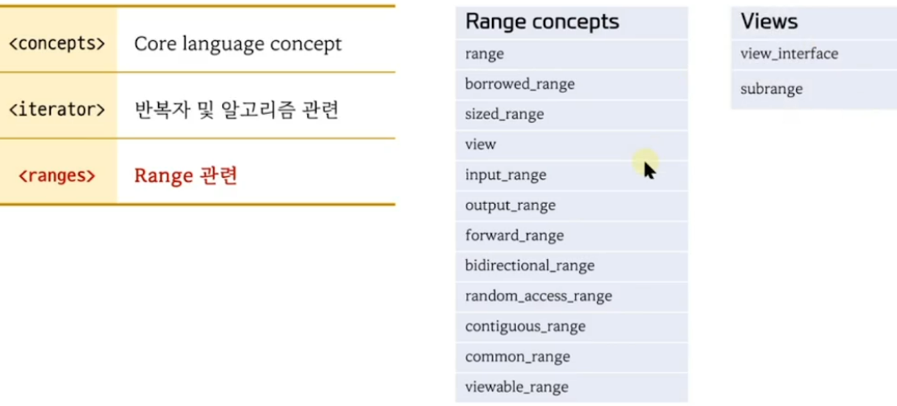

```c++
#include <iostream>
#include <list>
#include <vector>
#include <algorithm>
#include <iterator>

template<std::random_access_iterator T> 
void sort(T first, T last)
{
    std::cout << "random_access_iterator" << std::endl;
}
template<std::bidirectional_iterator T> 
void sort(T first, T last)
{
    std::cout << "bidirectional_iterator" << std::endl;
}
int main()
{
    std::vector<int> v = {1,3,5,7,9,2,4,6,8,10};
    std::list<int>   s = {1,3,5,7,9,2,4,6,8,10};

//    std::sort(v.begin(), v.end()); // ok
//    std::sort(s.begin(), s.end()); // error
//    s.sort(); // ok
    sort(v.begin(), v.end());
    sort(s.begin(), s.end());
}
```

```c++
#include <iostream>
#include <algorithm>
#include <iterator>


// T2가 인자로 T1::value_type 받을수 있는 함수인 경우
// template<typename T1, typename T2> requires std::predicate<T2, typename std::interator_traits<T1>::value_type >

template<typename T1, typename T2> requires std::predicate<T2, std::iter_value_t<T1> >
T1 find (T1 first, T1 last, T2 pred)
{
    std::cout << "predicate version" << std::endl;
    return first;
}

template<typename T1, typename T2> requires (!std::predicate<T2, typename std::interator_traits<T1>::value_type >)
T1 find (T1 first, T1 last, T2 pred)
{
    std::cout << "value version" << std::endl;
    return first;
}

int main() 
{
    int x[10]{1,2,3,4,5,6,7,8,9,10}

    // auto p1 = std::find(std::begin(x), std::end(x), 3);
    // auto p1 = std::find(std::begin(x), std::end(x), [](int n){ return n % 2 == 0;}]);

    auto p1 = std::find(std::begin(x), std::end(x), 3);
    auto p1 = std::find(std::begin(x), std::end(x), [](int n){ return n % 2 == 0;}]);
}

```