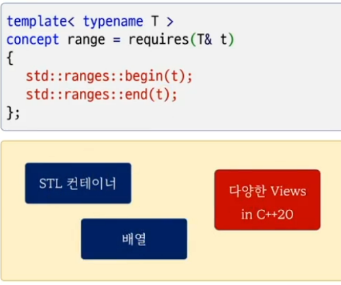

```c++
#include <iostream>
#include <vector>
#include <ranges> 
#include <algorithm>

int main()
{
    std::vector<int> v = {1,2,3,7,8,9,4,5,6,10};
    //                      2     8   4
    //                      4     8   2
    auto r = v | std::views::filter( [](int a) { return a % 2 == 0;} ) | std::views::take(3);           

    for ( auto n : r)
        std::cout << n << std::endl;

    std::ranges::reverse( r );

    for ( auto n : v)
        std::cout << n << ", ";

    std::cout << std::endl;
}
```


```c++
#include <iostream>
#include <vector>
#include <ranges> 

int main()
{
    std::vector<int> v = {1,2,3,4,5,6,7,8,9,10};

    auto r1 = v | std::views::take(3);  

    std::ranges::take_view tv(v, 3);


    std::cout << typeid(r1).name() << std::endl;
    std::cout << typeid(tv).name() << std::endl;
}
```

# Range 개념
- abstraction of a collection of items
- something iterable
- 최소의 요구 조건 - "begin(), end()를 사용할수 있는 것"


```c++
#include <iostream>
#include <ranges>
#include <vector>

int main()
{
    bool b1 = std::ranges::range<int>;
    bool b2 = std::ranges::range<int[5]>;
    bool b3 = std::ranges::range<std::vector<int>>;
   
    std::cout << b1 << std::endl; // false 
    std::cout << b2 << std::endl; // true
    std::cout << b3 << std::endl; // true

    std::vector<int> v = {1,2,3,4,5,6,7,8,9,10}; 
    auto r = v | std::views::take(3);

    bool b4 = std::ranges::range<decltype(r)>;
    std::cout << b4 << std::endl;  // true
}

```

