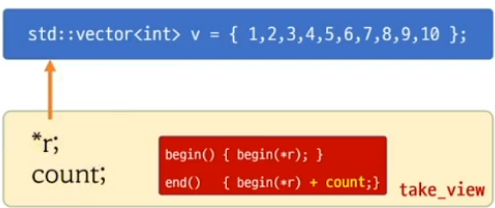
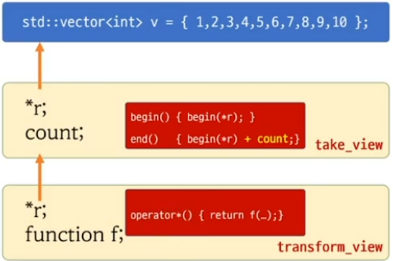

# views
- composable adaptations of ranges where the adaptation happens lazily as the view is iterated." from Eric Nieblers/s range-v3 implementation



# views 특징
- can be combined


- lazy operation

```c++
#include <iostream>
#include <ranges>
#include <vector>

int main()
{
    std::vector<int> v = {1,2,3,4,5,6,7,8,9,10};

    // auto r = v | std::views::take(3);

    std::ranges::take_view tv(v, 3);

    std::ranges::transform_view trv(tv, [](int a) { std::cout << "op" << std::endl; return a*2;});
    std::cout << "start iterating" << std::endl;

    auto p1 = std::ranges::begin(trv);

    v[0] =100;
    
    std::cout << *p1 << std::endl; 
}
```

```c++
#include <iostream>
#include <ranges>
#include <vector>

int main()
{
    std::vector<int> v = {1,2,3,4,5,6,7,8,9,10};

    std::ranges::take_view tv(v, 3);
    std::ranges::transform_view trv(tv, [](int a) { return a*2;});

    auto r = v | std::views::take(3) | std::views::transform(  [](int a) { return a*2;});

    for( auto n : r )
        std::cout << n << std::endl;  // 2, 4, 6
}
```