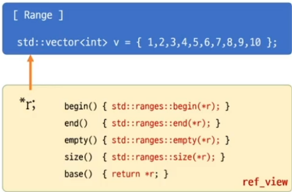

# std::ref_view
- Range에 대한 reference



```c++
#include <iostream>
#include <ranges>
#include <vector>

int main()
{
    std::vector<int> v = {1,2,3,4,5,6,7,8,9,10};

    std::ranges::ref_view rv(v);

    auto p1 = rv.begin();
    auto p2 = v.begin();

    std::cout << *p1 << std::endl; // 1
    std::cout << *p2 << std::endl; // 2

    std::cout << &v           << std::endl;
    std::cout << &(rv.base()) << std::endl;

    std::vector<int>& r = v;
    r.begin();

}
```
# std::ref_view
- C++11의 `std::reference_wrapper`의 range 버전
- 이동 가능한 참조


```c++
#include <iostream>
#include <ranges>
#include <vector>

int main()
{
    std::vector<int> v1 = {1,2,3,4,5};
    std::vector<int> v2 = {6,7,8,9,0};

    // C++ 참조 : 이동 불가능한 참조 - 
    //std::vector<int>& r1(v1);
    //std::vector<int>& r2(v2);
    std::ranges::ref_view r1(v1);
    std::ranges::ref_view r2(v2);

    r1 = r2; // 이 한줄의 효과는 ? 
             // 진짜 참조 사용시.. vector 자체를 복사

    std::cout << v1[0] << std::endl; // 1
    std::cout << v2[0] << std::endl; // 6
    std::cout << r1[0] << std::endl; // 6
    std::cout << r2[0] << std::endl; // 6
}
```

```c++
#include <iostream>
#include <vector>
#include <ranges>

template<typename R> class take_view 
{
	//R& rg;      
    //std::ranges::ref_view<R> rg;
    R rg;  // std::ranges::ref_view< std::vector<int> >
	int count;
public:
	template<typename A>
	take_view(A&& r, int cnt) : rg(std::forward<A>(r)), count(cnt) {}
    // ...... begin(), end() 등..
};
template<typename A>
take_view(A&&, int) -> take_view< std::ranges::ref_view<std::remove_reference_t<A> > >;

int main()
{
	std::vector<int> v1 = { 1,2,3,4,5 };
	std::vector<int> v2 = { 6,7,8,9,0 };

	take_view tv1(v1, 3);
	take_view tv2(v2, 3);

    tv1 = tv2;
}
```

```c++
#include <iostream>
#include <vector>
#include <ranges>

int main()
{
	std::vector<int> v = { 1,2,3,4,5 };

    std::ranges::ref_view< std::vector<int> > rv1(v);
    std::ranges::ref_view rv2(v);

    auto rv3 = std::views::all(v);


    std::cout << typeid(rv1).name() << std::endl;    
    std::cout << typeid(rv2).name() << std::endl;  
    std::cout << typeid(rv3).name() << std::endl;  
}
```