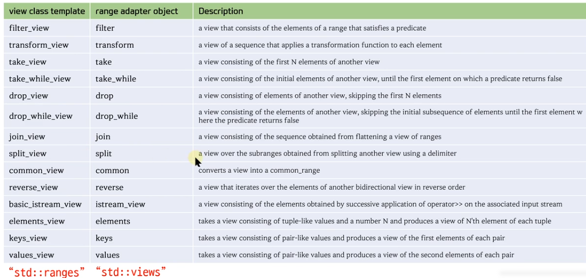

# Ranges Views



 # View를 생성하는 방법
 1) view class template을 직접 생성
 2) Range adapter object 사용

 ```c++
#include <iostream>
#include <vector>
#include <ranges>

int main()
{
    std::vector<int> v = {1,2,3,4,5,6,7,8,9,10};
    // 1번
    std::ranges::reverse_view rv1(v);

//    std::ranges::reverse_view< std::vector<int> > rv2(v);
//    std::ranges::reverse_view< std::ranges::ref_view<std::vector<int>> > rv2(v);

    // 2번
    auto rv2 = std::views::reverse(v);


    std::cout << typeid(rv1).name() << std::endl;

    for( auto n : rv1 )
        std::cout << n << ", ";
}
 ```

# View의 중첩
1) 객체를 직접 만들어서 사용
2) 파이프 라인 사용

 ```c++
#include <iostream>
#include <vector>
#include <ranges>

int main()
{
    std::vector<int> v = {1,2,3,4,5,6,7,8,9,10};
    // 1-1번
    std::ranges::filter_view  fv1(v, [](int n) { return n % 2 ==0; });
    std::ranges::take_view    tv1(fv1, 3);
    std::ranges::reverse_view rv1(tv1);
    // 1-2번
    auto fv2 = std::views::filter(v, [](int n) { return n % 2 ==0; } );
    auto tv2 = std::views::take(fv2, 3);
    auto rv2 = std::views::reverse(tv2);
    // 2번
    auto rv3 = v | std::views::filter( [](int n) { return n % 2 ==0; } ) 
                 | std::views::take(3)
                 | std::views::reverse;

    for(auto n : rv1) std::cout << n << ", "; // 6, 4, 2
    for(auto n : rv2) std::cout << n << ", ";
    for(auto n : rv3) std::cout << n << ", ";
}

 ```