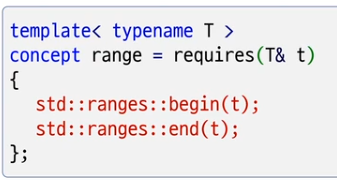

# 기존 STL 알고리즘 vs Ranges 알고리즘
1) 기존의 알고리즘 인자로 `반복자` 전달
2) Range 알고리즘은 인자로 `Range` 전달
   



```c++
#include <iostream>
#include <vector>
#include <ranges>
#include <algorithm>

int main()
{
    std::vector<int> v = {1,3,5,7,9,2,4,6,8,10};

    std::sort(v.begin(), v.end());   

    std::ranges::sort(v);

    auto fv = v | std::views::filter([](int n) { return n % 2 == 0; });

    std::ranges::replace_if( fv, [](int n) { return n > 0;}, 0);
   
    for( auto n : v )
        std::cout << n << ", ";
}

```

```c++
#include <iostream>
#include <vector>
#include <ranges>
#include <algorithm>
#include <functional>
#include <string>

struct People
{
    std::string name;
    int  age;
};

int main()
{
    std::vector<People> v;

    v.emplace_back("aaa", 20);
    v.emplace_back("sss", 30);
    v.emplace_back("ccc", 10);
    v.emplace_back("xxx", 50);
    v.emplace_back("bbb", 40);

    //std::ranges::sort(v);
    //std::ranges::sort(v, [](const People& p1, const People& p2) { return p1.age < p2.age;});

    // std::ranges::sort(v, std::greater{}, &People::name);
    std::ranges::sort(v, {}, &People::name);

    for ( auto&& p : v)
        std::cout << p.name << "(" << p.age << ")" << std::endl;
}

```


