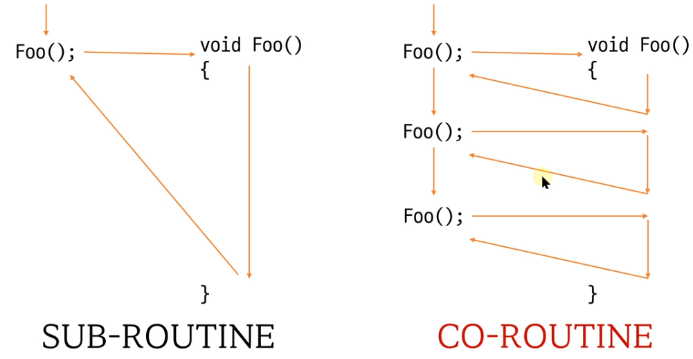

# coroutine 개념



```c++
#include <iostream>
#include <coroutine>
using namespace std;

struct Generator
{
	struct Promise
	{
		int value;
		Generator get_return_object()
		{
			return Generator{ std::coroutine_handle<Promise>::from_promise(*this) };
		}
		auto initial_suspend() { return std::suspend_always{}; }
		auto yield_value(int x){ value = x; return std::suspend_always{}; }
		auto return_void()     { return std::suspend_never{}; }
		auto final_suspend()   { return std::suspend_always{};}
		void unhandled_exception() { std::exit(1); }
	};
	using promise_type = Promise;
	coroutine_handle<Promise> coro;

	Generator(coroutine_handle<Promise> h) : coro(h) {}

	~Generator() { if (coro) coro.destroy(); }
	int value()  { return coro.promise().value; }
	bool next()	 { coro.resume(); return !coro.done(); }
};

Generator foo(int n)
{
	std::cout << "\tRun 1 : " << std::endl;
	
    co_await std::suspend_always{};

	std::cout << "\tRun 2" << std::endl;
	
    co_await std::suspend_always{};
	
    std::cout << "\tRun 3" << std::endl;
}
int main()
{
	Generator f = foo(10);
	std::cout << "main 1 : " << std::endl;

	f.next();
	std::cout << "main 2" << std::endl;

	f.next();
	std::cout << "main 3" << std::endl;
	f.next();
}
```