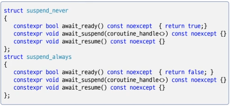
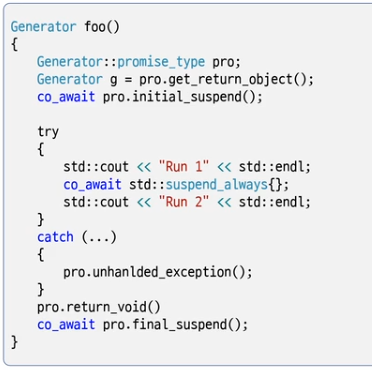

# step 1. 헤더 파일, co_await
- `<coroutine>`
- `co_await std::suspend_always{}`

# awaitable object



```c++
#include <iostream>
#include <coroutine>

void foo()
{
    std::cout << "Run 1" << std::endl;

    co_await std::suspend_always {};

    //std::suspend_always sa;
    //co_await sa;

    std::cout << "Run 2" << std::endl;
}

int main()
{
    foo();
}
```

# step 2. coroutine framework
- 함수를 coroutine으로 동작하게 하려면 C++ 언어에 정의된 규칙을 구현한 사용자 정의 타입을 반환해야 한다.



- Generator 규칙
  1) promise_type 이 있어야 한다.\
  2) std::coroutine_handle<> 멤버
  3) 인자가 한 개인 생성자
  4) 소멸자에서 coroutine 파괴

- Promise 규칙
  1) get_return_object()
  2) initial_suspend()
  3) unhandled_exception()
  4) return_voide()
  5) final_suspend()


```c++
#include <iostream>
#include <coroutine>

class Generator
{
public:
    struct Promise
    {
		Generator get_return_object()
		{
			return Generator{ std::coroutine_handle<Promise>::from_promise(*this) };
		}
		auto initial_suspend() { return std::suspend_always{}; }
		auto return_void() { return std::suspend_never{}; }
		auto final_suspend() noexcept { return std::suspend_always{}; }
		void unhandled_exception() { std::exit(1); }
    };
    using promise_type = Promise;

    std::coroutine_handle<promise_type> coro;

    Generator( std::coroutine_handle<promise_type> c ) : coro(c) {}

    ~Generator() { if ( coro ) coro.destroy();}
};

Generator foo()
{
    std::cout << "Run 1" << std::endl;
    co_await std::suspend_always {};
    std::cout << "Run 2" << std::endl;
}

int main()
{
    foo();
}

```

# step 3. promise, coroutine_handle<>

```c++
#include <iostream>
#include <coroutine>

class Generator
{
public:
    struct Promise
    {       
		Generator get_return_object()
		{
			return Generator{ 
                std::coroutine_handle<Promise>::from_promise(*this) };
		}

		auto initial_suspend() { return std::suspend_always{}; }
		auto return_void()     { return std::suspend_never{}; }
		auto final_suspend() noexcept   { return std::suspend_always{}; }
		void unhandled_exception() { std::exit(1); }
    };
    using promise_type = Promise;
    std::coroutine_handle<promise_type> coro;
    Generator( std::coroutine_handle<promise_type> c ) : coro(c) {}
   
    ~Generator() { if ( coro ) coro.destroy();}
};
Generator foo()
{
    std::cout << "Run 1" << std::endl;
    co_await std::suspend_always {};
    std::cout << "Run 2" << std::endl;
}
int main()
{
    Generator g = foo();

    std::cout << "\tmain1" << std::endl;
    g.coro.resume();
    //g.coro.promise_type();

    std::cout << "\tmain2" << std::endl;
    g.coro.resume();

    std::cout << "\tmain3" << std::endl;
}
```