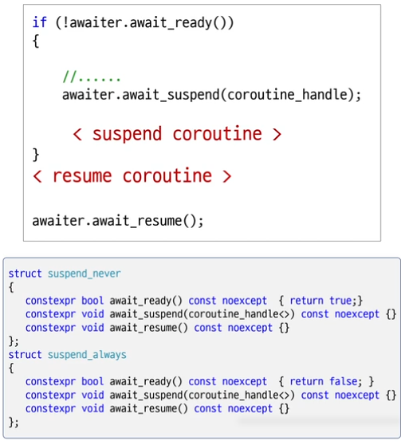

# awaitable object




```c++
#include <iostream>
#include <coroutine>
#include <thread>

class Generator
{
public:
    struct Promise
    {
        Generator get_return_object()
        {
            return Generator{ std::coroutine_handle<Promise>::from_promise(*this) };
        }
        auto initial_suspend() { return std::suspend_always{}; }
        auto return_void() { return std::suspend_never{}; }
        auto final_suspend() noexcept  { return std::suspend_always{}; }
        void unhandled_exception() { std::exit(1); }
    };
    using promise_type = Promise;
    std::coroutine_handle<promise_type> coro;
    Generator(std::coroutine_handle<promise_type> c) : coro(c) {}

    ~Generator() { if (coro) coro.destroy(); }
};

struct resume_new_thread
{
    void await_suspend(std::coroutine_handle<> handle)
    {
        std::thread t([handle]() { handle(); });
        t.detach();
    }
    constexpr bool await_ready() const noexcept { return false; }
    constexpr void await_resume() const noexcept { }
};

Generator foo()
{
    std::cout << "Run 1 : " << std::this_thread::get_id() << std::endl;
    
    co_await resume_new_thread{};

    //co_await std::suspend_always{};   
    //std::suspend_never awaiter;
    //co_await awaiter;
    
    std::cout << "Run 2 : " << std::this_thread::get_id() << std::endl;  
}

int main()
{
    Generator g = foo();
    g.coro.resume();
    std::cout << "main" << std::endl;
    int n;
    std::cin >> n;     
}


 
```