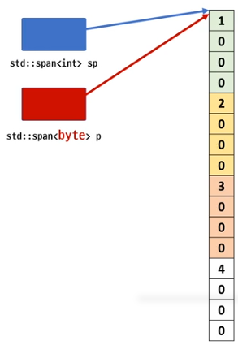

# std::span
- 연속된 메모리의 시작 주소와 개수를 관리하는 도구
- 배열, std::vector, std::array
- std::string_view와 유사
- std::string_view는 읽기만 가능하지만 std::span은 읽기/쓰기 모두 가능

```c++
#include <iostream>
#include <vector>
#include <span>

//void foo(int* arr)
void foo( std::span<int> sp )
{
    std::cout << sp.size() << std::endl;

    sp[0] = 10;
}

int main()
{
//    int x[10]{1,2,3,4,5,6,7,8,9,10};
    std::vector<int> x{1,2,3,4,5,6,7,8,9,10};

    foo(x);
}
```


```c++
#include <iostream>
#include <span>

int main()
{
    int x[10] = { 1,2,3,4,5,6,7,8,9,10 };

    std::span<int>     sp1(x);  // ok  T : int
    std::span<int, 10> sp2(x);  // ok  T : int[10]

    std::cout << sizeof(sp1) << std::endl; // 8
    std::cout << sizeof(sp2) << std::endl; // 4
    
    std::cout << sp1.extent << std::endl; // -1
    std::cout << sp2.extent << std::endl; // 10

    std::cout << sp1.size() << std::endl; // 10
    std::cout << sp1.size_bytes() << std::endl; // 40
    std::cout << sp2.size() << std::endl; // 10
    std::cout << sp2.size_bytes() << std::endl; // 40

    int* p = new int[10]{ 1,2,3,4,5,6,7,8,9,10 };
   
 //   std::span<int> sp3(p);     // error
    std::span<int> sp4(p, 10); // ok
 //   std::span<int, 10> sp5(p); // error 
}
```

# std::as_bytes, std::as_writable_bytes
- 임의 타입의 span<T> 를 `span<bytes>`으로 변경하는 함수
- T* 를 byte*로 변경하는 의미




```c++
#include <iostream>
#include <span>

void foo(std::span<int> sp)
{
    // std::span<byte>
    //auto p = std::as_bytes(sp);
    auto p = std::as_writable_bytes(sp);

    //p[3] = 0x33;
    p[3] = static_cast<std::byte>(0x33);
    
    std::cout << std::hex << sp[0] << std::endl; //0x33000001
}

int main()
{
    int x[10]{1,2,3,4,5,6,7,8,9,10};
    int* p = new int[10]{1,2,3,4,5,6,7,8,9,10};

    foo(x); // int[10]
 //   foo(p); // int*  error
    foo({p, 10});

}
```