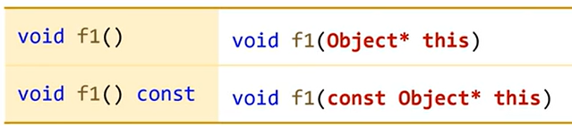
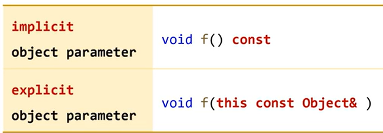

 # 멤버 함수의 호출 원리 (this call)
 - 멤버 함수 호출시 객체의 주소가 같이 전달되는 것


<변경 전 코드>
 ```c++
class Point
{
    int x{0};
    int y{0};
public:
    void set1(int a, int b)
    {
        x = a;
        y = b;
    }
};

int main()
{
    Point pt;
    pt.set1(10, 20);
}
 ```
<변경 후 코드>
 ```c++
class Point
{
    int x{0};
    int y{0};
public:
    void set1(Point* this, int a, int b)
    {
        this->x = a;
        tihs->y = b;
    }
};

int main()
{
    Point pt;
    pt.set1(&pt, 10, 20);
}
 ```


<c++ 20>

```c++
class Point
{
    int x{0};
    int y{0};
public:
    void set1(int a, int b)
    {
        x = a;
        y = b;
    }
    void set2(this Point& self, int a, int b)
    {
        self.x = a;
        self.y = b;
    }
};

int main()
{
    Point pt;
    pt.set1(10, 20);
    pt.set2(10, 20);
}
```

# const member function과 this


#explicit object parameter는 const 키워드를 함수 인자로 표기


# deducing this
- explicit object parameter를 사용하면 템플릿을 사용해서 객체의 타입을 추론할수 있다.
- 함수 템플릿을 사용해서 const member function과 non-const member function을 자동 생성할수 있다.


```c++
class Object
{
public:
    void f1()        {} // 1
    void f1() const  {} // 2

    void f2(this Object& self) {}
    void f2(this const Object& self) {}

    templat<typename T>
    void f3(this T& self) {}
}

int main()
{
    Object o1;
    const Object o2;

    o1.f1();
    o2.f1();

    o1.f2();
    o2.f2();

    o1.f3();
    o2.f3();
}
```

```c++
struct array
{
    int buff[5];

    // int& operator[](int idx) {return buff[idx];}
    // const int& operator[](int idx) const {return buff[idx];}

    template<typename T>
    decltype(auto) operator[](this T& self, int idx) { return self.buff[self.idx];}
};

int main()
{
    array a1 = {1,2,3,4,5};
    const array a2 = {1,2,3,4,5};

    a1[0] = 10;
    // a2[0] = 10;  // error
}
```