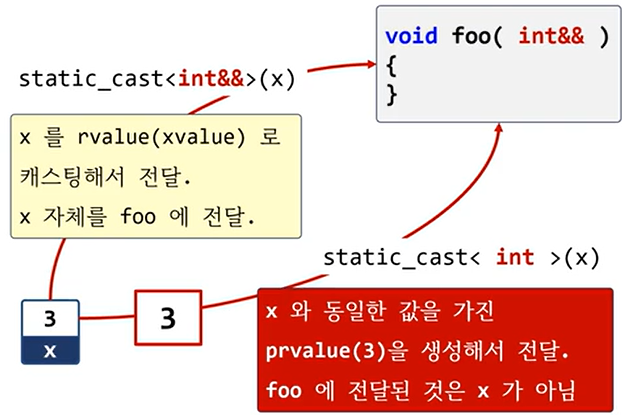
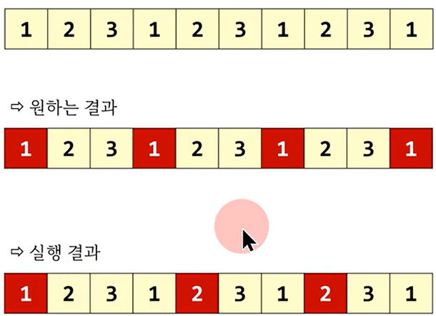

# 핵심 저일


# auto(expression), auto{expression}
- expression의 결과 값이 prvalue 생성
- x = 3 일때 auto{x} 는 3

```c++
void foo(int& r)
{
    std::println("lvalue : {}", static_cast<void*>(&r));
}

void foo(int&& r)
{
    std::println("rvalue : {}", static_cast<void*>(&r));
}

int main()
{
    int x = 3;

    foo(x); // lvalue
    foo(3); // rvalue

    foo(static_cast<int&&>(x));
    foo(static_cast<int>(x));

    foo( auto(x) );  // auto{x}
}
```

# 다음 컨테이너에서 1번째 요소와 동일한 요소를 제거하고 싶다.


# vector::front 멤버 함수는 reference를 반환하고, std::remove도 3번째 인자로 reference 사용

```c++
#include <algorithm>
#include <vector>
#include <print>

template<typename C>
void foo(C& c)
{
    auto ret = std::remove(c.begin(), c.end(), c.front());

    c.erase(ret, c.end());

    for( auto e : c)
        std::print("{}, ", e);
}

int main()
{
    std::vector v{1,2,3,1,2,3,1,2,3,1};

    foo(v);
}
```

# 해결책
- std::remove 의 3번째 인자로, c.front()를 직접 전달하지 말고
- c.front() 가 반환하는 값을 전달

```c++
#include <algorithm>
#include <vector>
#include <print>

template<typename C>
void foo(C& c)
{
    // auto ret = std::remove(c.begin(), c.end(), c.front());

    // #1.
    // auto n = c.front();
    // auto ret = std::remove(c.begin(), c.end(), n);

    // #2.
    // using T = std::decay_t<decltype(c.front())>;
    // auto ret = std::remove(c.begin(), c.end(), static_cast<T>(c.front()));

    #3
    auto ret = std::remove(c.begin(), c.end(), auto(c.front()));

    c.erase(ret, c.end());

    for( auto e : c)
        std::print("{}, ", e);
}

int main()
{
    std::vector v{1,2,3,1,2,3,1,2,3,1};

    foo(v);
}
```