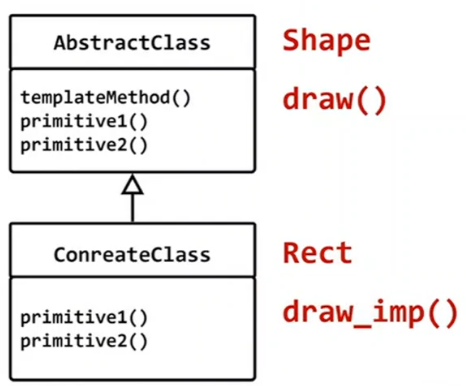

## GUI 환경에서 윈도우에 그림 그리기
- 대부분의 라이브러리에는 그림을 그리기 위한 클래스를 제공
- 화면 깜빡임 등을 방지하기 위해 다양한 방법을 제공(더블 버퍼링 등)


## code 중복이 있음
```c++
#include <iostream>
#include "Painter.h"

class Shape
{
public:
	virtual ~Shape() {}
	virtual void draw() = 0;
};

class Rect : public Shape
{
public:
	void draw() override
	{
		PainterPath path;
		path.begin();

		// path 멤버 함수로 그림을 그린다.
		path.draw_rect();

		path.end();

		Painter surface;
		surface.draw_path(path);
	}
};


class Circle : public Shape
{
public:
	void draw() override
	{
		PainterPath path;
		path.begin();

		// path 멤버 함수로 그림을 그린다.
		path.draw_circle();
		
		path.end();

		Painter surface;
		surface.draw_path(path);
	}
};

int main()
{
	Shape* s1 = new Rect;
	Shape* s2 = new Circle;

	s1->draw();
	s2->draw();
}
```

## 핵심 
- 변하지 않는 코드 내부에 있는 변해야 하는 코들 찾는다.
- 변해야 하는 코드는 가상함수로 분리 한다.
- 파생 클래스는 알고리즘의 처리 과정을 물려받으면서 가상함수 재정의를 통해서 변경이 필요한 부분만 다시 만들수 있다.
- draw() : 알고리즘의 처리과정은 변경되지 않는다.
- draw_imp() : 파생클래스에 따라서 변화가 필요한 부분 (변겨할 기회를 주고 싶은 코드) 가상함수로 분리

```c++
#include <iostream>
#include "Painter.h"

class Shape
{
public:
	virtual ~Shape() {}

	void draw() 
	{
		PainterPath path;
		path.begin();

		// path 멤버 함수로 그림을 그린다.
		draw_imp(path);

		path.end();

		Painter surface;
		surface.draw_path(path);		
	}

protected:
	virtual void draw_imp(PainterPath& path) = 0;
};

class Rect : public Shape
{
protected:
	void draw_imp(PainterPath& path) override
	{
		path.draw_rect();
	}
};

class Circle : public Shape
{
protected:
	void draw_imp(PainterPath& path) override
	{
		path.draw_circle();
	}
};

int main()
{
	Shape* s1 = new Rect;
	Shape* s2 = new Circle;

	s1->draw();
	s2->draw();
}
```

# template method
## 행위 패턴(Behavior Pattern)
## 의도 (intent)
- 오퍼레이션에는 알고리즘의 처리 과정만을 정의하고 각 단계에서 수행할 구체적인 처리는 서브클래스에서 정의한다. Template Method 패턴은 알고리즘의 처리 과정은 변경하지 않고 알고리즘 각 단계의 처리는 서브클래스에서 재정의 할수 있게 한다.



