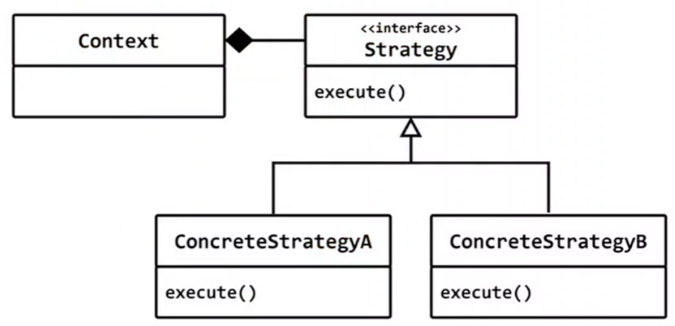

# Strategy (전략패턴)
## 행위패턴 (Behavior Pattern)
## 의도 (intent)
- 다양한 알고리즘이 존재하면 이들 각각을 하나의 클래스로 캡슐화하여 알고리즘의 대체가 가능하도록 한다. Strategy 패턴을 이용하면 클라이언트와 독립적인 다양한 알고리즘으로 변형할수 있다. 알고리즘을 바꾸더라도 클라이언트는 아무런 변경을 할 필요가 없다.



```c++
#include <iostream>
#include <string>
#include <conio.h>

class Edit
{
	std::string data;
public:
	std::string get_text()
	{
		std::cin >> data;
		return data;
	}
};

int main()
{
	Edit edit;
	while (1)
	{
		std::string s = edit.get_text();
		std::cout << s << std::endl;
	}
}
```

## Edit 클래스
- 사용자에게 입력을 받을때 사용하는 GUI Widget(컨트롤)

## Edit를 사용해서 나이를 입력받고 싶다.
- 숫자만 입력되로독 제한(validation) 해야 한다.

## Edit의 validataion 정책을 변경될수 있어야 한다.
- Edit 클래스를 어떻게 디자인해야 할까?

## Validation 정책 변경 방법 #1
- 변하는 것을 가상함수로 분리
- template method 패턴

## iscomplete(data)
- 입력 값이 완성되었는지 확인

```c++
#include <iostream>
#include <string>
#include <conio.h>

class Edit
{
	std::string data;
public:

	std::string get_text()
	{
		data.clear();

		while (1)
		{
			char c = _getch();

			if (c == 13 && iscomplete(data) ) break;

			if (validate(data, c))
			{
				data.push_back(c);
				std::cout << c;
			}
		}
		std::cout << "\n";
		return data;
	}
	virtual bool validate(const std::string& data, char c)
	{
		return true;
	}
	virtual bool iscomplete(const std::string& data)
	{
		return true;
	}
};

class NumEdit : public Edit
{	
	int count;
public:
	NumEdit(int count = 9999) : count(count) {}

	bool validate(const std::string& data, char c) override
	{		
		return data.size() < count && isdigit(c);
	}
	bool iscomplete(const std::string& data) override
	{
		return count != 9999 && data.size() == count;
	}
};

int main()
{
//	Edit edit;
	NumEdit edit(5); // 5자리 숫자만, 5자리 입력 되어야만 enter 가능
	
//	AddressEdit edit2;
	while (1)
	{
		std::string s = edit.get_text();
		std::cout << s << std::endl;
	}
}
```

## Edit 의 Validation 정책 교체 방법
- template method가 최선의 방법일까?
- 다른 방법은 없을까?

