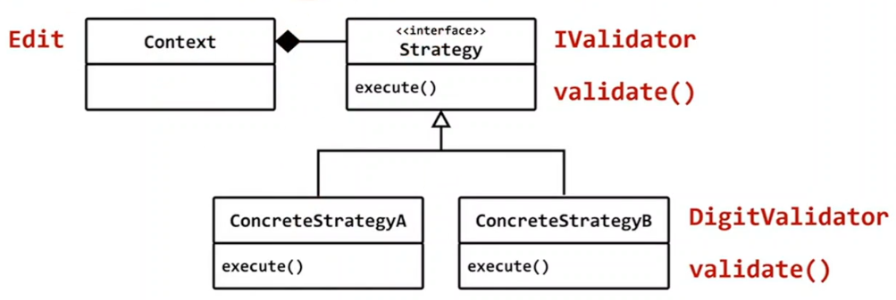

## 변하는 것을 분리할때 사용하는 2가지 방법
- 변하는 코드를 가상함수로 분리
- 변하는 코드를 다른 클래스로 분리

## 인터페이스를 먼저 만들고 Edit에서 약한 결합으로 다양한 Validation 정책 클래스 사용
- validation 정책을 담은 다양한 클래스

```c++
#include <iostream>
#include <string>
#include <conio.h>

struct IValidator
{
	virtual bool validate(const std::string& data, char c) = 0;
	virtual bool iscomplete(const std::string& data) { return true;}
	virtual ~IValidator() {}
};

class DigitValidator : public IValidator
{
	int count;
public:
	DigitValidator(int count = 9999) : count(count) {}

	bool validate(const std::string& data, char c) override 
	{
		return data.size() < count && isdigit(c);
	}
	bool iscomplete(const std::string& data) override 
	{
		return count != 9999 && data.size() == count;
	}
};

class Edit
{
	std::string data;
	IValidator* val = nullptr;
public:
	void set_validator(IValidator* p) { val = p;}
	std::string get_text()
	{
		data.clear();
		while (1)
		{
			char c = _getch();

			if (c == 13 && ( val == nullptr || val->iscomplete(data)    )  ) break;
			
			if (val == nullptr || val->validate(data, c))
			{
				data.push_back(c);
				std::cout << c;
			}
		}
		std::cout << "\n";
		return data;
	}
};

int main()
{
	Edit edit;
	DigitValidator v(5);
	edit.set_validator(&v);
	
//	DigitValidator v2(15);
//	edit.set_validator(&v2);

	while (1)
	{
		std::string s = edit.get_text();
		std::cout << s << std::endl;
	}
}
```

## Validation 정책을 가상함수로 분리 (template method, 템플릿 패턴)
- NumEdit 가 Validation 정책을 소유
- 다른 클래스에서 Validation 정책을 사용할수 없다.
- 실행시간에 Validation 정책을 교체할수 없다.

## Validation 정책을 다른 클래스로 분리 (Strategy, 전략패턴)
- Edit와 Validation 정책이 서로 다른 클래스로 분리
- 다른 클래스에서 Validation 정책을 사용할수 있다.
- 실행시간에 Validation 정책을 교체할수 있다.


## Edit 예제의 경우는 strategy가 더 적합하지만,
## template method 자체가 나쁜 것은 아님

## 사각형을 그리는 방법은
- 다른 클래스에서 사용해야될 일이 없고,
- 실행시간에 교체할 이유가 없음.
- 가상함수로 구현되면 멤버함수이므로 멤버 데이터 접근도 편리함.

# Strategy (전략패턴)
## 행위 패턴(Behavior Pattern)
## 의도 (intent)
- 다양한 알고리즘이 존재하면 이들 각각을 하나의 클래스로 캡슐화하여 알고리즘의 대체가 가능하도록 한다. Strategy 패턴을 이용하면 클라이언트와 독립적인 다양한 알고리즘으로 변형할수 있다. 알고리즘을 바꾸더라도 클라이언트는 아무런 변경을 할 필요가 없다.

