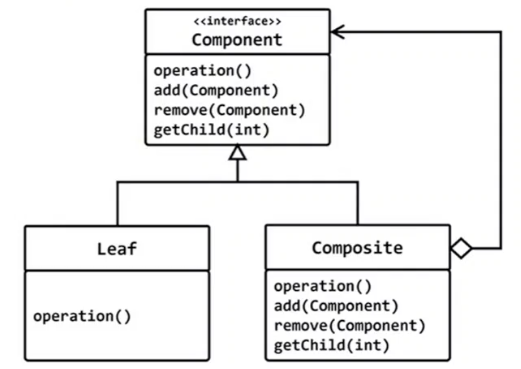

# composite
## 구조 패턴(structural pattern)

## 의도 (intent)
- 부분과 전체의 계층을 표현하기 위한 복합 객체를 트리 구조로 만든다.
- composite 패턴은 클라이언트로 하려면 개별 객체와 복합 객체를 모두 동일하게 다룰수 있도록 한다.



## C언어에서 프로그램이란?
- main함수의 1번째 줄부터 순차적으로 실행되는 실행 흐름
- 실행순서를 변경하려면 제어문, 반복하려면 반복문을 사용한다.
- 프로그램의 기본 단위는 `함수`이다.

## 장점
- 프로그램의 구조가 이해하기 쉽다.
- CPU의 동작 방식과 동일하다. 빠르다.
- 메모리 사용량도 작다.

## 단점
- 확장성이 부족하고, 변화에 유연하지 않다.
- 유지보수가 쉽지 않다.
- 새로운 메뉴 추가되거나, 하위 메뉴를 추가한다면?

## 객체지향 프로그램에서 프로그램은
- `객체들의 집합`
- 프로그램의 기본 요소는 함수가 아닌 `클래스`이다.

## 메뉴의 각 항목을 나타내는 `MenuItem` 클래스 설계

## PopupMenu
- 선택했을때 하위 메뉴를 열어주는 메뉴
- 타이틀이 있고 (std::string title)
- 여러개의 하위 메뉴(MenuItem)를 보관해야 한다. (std::vector<MenuItem*>)

## PopupMenu를 선택했을때 해야할 일
- 하위 메뉴를 보여주고
- 사용자 선택 입력 받음
 

```c++
#include <iostream>
#include <string>
#include <vector>
#include <conio.h>

class MenuItem
{
	std::string title;
	int id;
public:
	MenuItem(const std::string& title, int id)
		: title(title), id(id) {}
	std::string get_title() const { return title; }
	void set_title(const std::string& s) { title = s; }
	void command()
	{
		std::cout << get_title() << " 메뉴 선택\n";
		_getch();
	}
};

class PopupMenu
{
	std::string title;
	std::vector<MenuItem*> v;
public:
	PopupMenu(const std::string& title) : title(title) {}

	void add_menu(MenuItem* m) { v.push_back(m); }

	void command()
	{
		while(1)
		{
			system("cls");
			std::size_t sz = v.size();
			std::size_t i = 0;

			for (MenuItem* p : v)
			{
				std::cout << ++i << ". " << p->get_title() << "\n";
			}
			std::cout << i + 1 << ". 종료\n";
			std::cout << "메뉴를 선택해 주세요 >> ";
			int cmd;
			std::cin >> cmd;

			if ( cmd == sz + 1 )
				break;

			if ( cmd < 1 || cmd > sz + 1)
				continue;
			v[cmd - 1]->command();		
		}
	}
};

int main()
{
	MenuItem m1("김밥", 11);
	MenuItem m2("라면", 12);
	PopupMenu pm("오늘의 메뉴");
	pm.add_menu(&m1);
	pm.add_menu(&m2);
	pm.command(); // 팝업 메뉴 선택
}
```