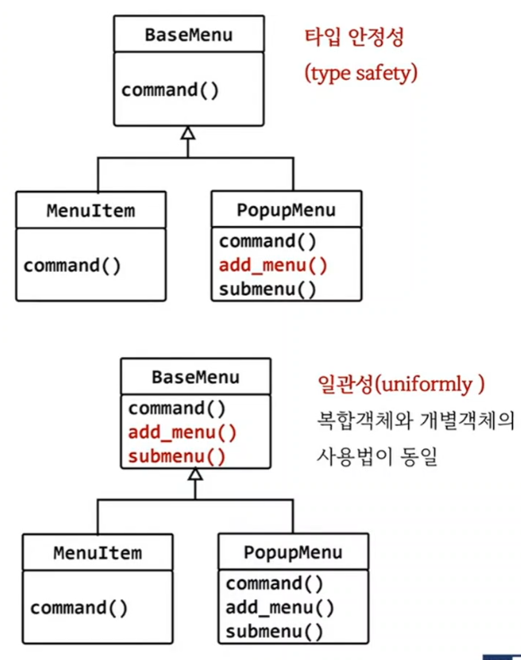
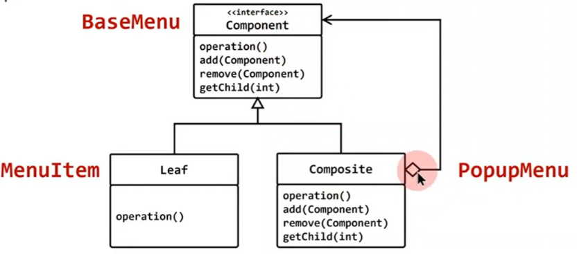

```c++
#include <iostream>
#include <string>
#include <vector>
#include <conio.h>

class no_implementation{};

class BaseMenu
{
	std::string title;
public:
	BaseMenu(const std::string& title) : title(title) {}
	virtual ~BaseMenu() {}
	std::string get_title() const { return title; }
	void set_title(const std::string& s) { title = s; }

	virtual void command() = 0;
	virtual BaseMenu* submenu(int idx) { throw no_implementation();}
	virtual void add_menu(BaseMenu* m) { throw no_implementation(); }
};

class MenuItem : public BaseMenu
{	
	int id;
public:
	MenuItem(const std::string& title, int id)
		: BaseMenu(title), id(id) {}

	void command()
	{
		std::cout << get_title() << " 메뉴 선택\n";
		_getch();
	}
};

class PopupMenu : public BaseMenu
{
	std::vector<BaseMenu*> v;
public:
	PopupMenu(const std::string& title) : BaseMenu(title) {}
	void add_menu(BaseMenu* m) { v.push_back(m); }
	void command()
	{
		while(1)
		{
			system("cls");
			std::size_t sz = v.size();
			std::size_t i = 0;

			for (BaseMenu* p : v)
			{
				std::cout << ++i << ". " << p->get_title() << "\n";
			}
			std::cout << i + 1 << ". 종료\n";
			std::cout << "메뉴를 선택해 주세요 >> ";

			int cmd;
			std::cin >> cmd;

			if ( cmd == sz + 1 )
				break;

			if ( cmd < 1 || cmd > sz + 1)
				continue;
			v[cmd - 1]->command();		
		}
    }
	BaseMenu* submenu(int idx)
	{
		return v[idx];
	}
};

int main()
{
	PopupMenu* root = new PopupMenu("ROOT");
	root->add_menu( new PopupMenu("색상 변경"));
	root->add_menu( new MenuItem("저장", 11));

//	root->submenu(0);
	root->submenu(0)->add_menu( new MenuItem("HD", 21));
	root->command();
}
```

# composite
## 구조 패턴(structural pattern)

## 의도 (intent)
- 부분과 전체의 계층을 표현하기 위한 복합 객체를 트리 구조로 만든다.
- composite 패턴은 클라이언트로 하려면 개별 객체와 복합 객체를 모두 동일하게 다룰수 있도록 한다.


