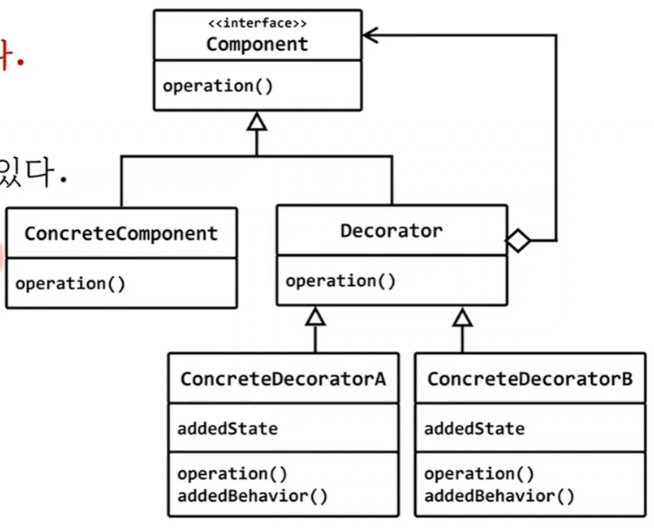

# decorator
## 구조 패턴 (structural pattern)
## 의도 (intent)
- 객체에 동적으로 서비스를 추가할수 있게 한다.
- 상속을 사용해서 서비스를 추가하는 것보다 유연한 방법으로 새로운 서비스를 추가할수 있다.




## Image 클래스
- 그림을 load해서 화면에 출력하는 클래스
- 파일뿐 아니라 인터넷 다운로드 지원

## load된 그림에 액자나 말풍선 등의 효과를 추가하로 싶다

## 상속을 사용하면 어떨까?
- Image 클래스로부터 모든 기능을 물려받고, 액자(또는 말풍선)를 그리는 기능을 추가

# 상속을 사용한 서비스 추가 특징
1) 객체가 아닌 클래스에 기능을 추가한 것
```c++
 Image img("www.image.com/car.jpg");
```
- 이순간 이미 그림을 load되었고, img 객체가 관리한다.
- img라는 객체에 새로운 기능을 추가할수 없을까?
- 상속은 Image 라는 클래스에 서비스를 추가한다.

2) 여러 개의 서비스를 중복해서 추가하기 어렵다.


