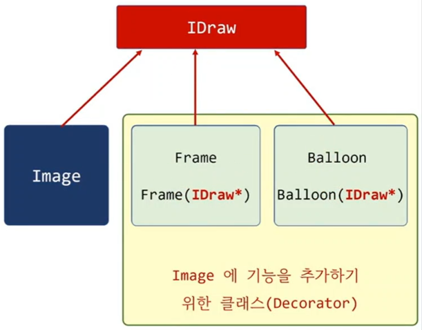
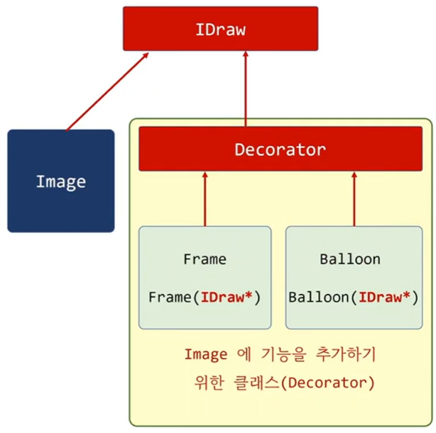
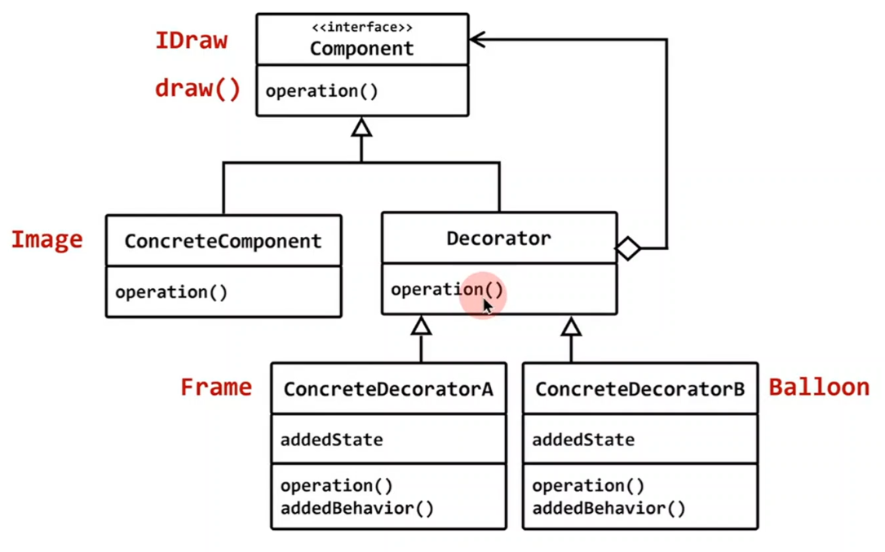

## 클래스가 아닌 객체에 기능을 추가하려면
- 상속이 아닌 포함을 사용한 기능의 추가

## 객체에 기능을 중복으로 계속 추가
- Image 클래스와 기능 추가 클래스를 위한 공통의 인터페이스


```c++
#include <iostream>
#include <string>


struct IDraw
{
	virtual void draw() const  = 0;
	virtual ~IDraw() {}
};

class Image : public IDraw
{
	std::string image_path;
public:
	Image(const std::string& path) : image_path(path) {	}
	void draw() const { std::cout << "draw " << image_path << std::endl; }
};

class Frame : public IDraw
{
	IDraw* img;
public:
	Frame(IDraw* img) : img(img) {}
	void draw() const 
	{ 
		std::cout << "==========================" << std::endl; 
		img->draw();
		std::cout << "==========================" << std::endl; 
	}
};

class Balloon : public IDraw
{
	IDraw* img;
public:
	Balloon(IDraw* img) : img(img) {}

	void draw() const 
	{ 
		std::cout << "== Balloon ===============" << std::endl; 
		img->draw();
		std::cout << "== Balloon ==============="  << std::endl; 
	}
};

int main()
{
	Image img("www.image.com/car.jpg");
	img.draw();

	Frame frame(&img);
	frame.draw();

	Balloon balloon(&frame); // ?
	balloon.draw();
}
```

 

```c++
#include <iostream>
#include <string>

struct IDraw
{
	virtual void draw() const  = 0;
	virtual ~IDraw() {}
};


class Image : public IDraw
{
	std::string image_path;
public:
	Image(const std::string& path) : image_path(path) {	}
	void draw() const { std::cout << "draw " << image_path << std::endl; }
};

class Decorator : public IDraw
{
	IDraw* img;
public:
	Decorator(IDraw* img) : img(img) {}
	void draw() const { img->draw();}
};

class Frame : public Decorator
{
public:
	Frame(IDraw* img) : Decorator(img) {}
	void draw() const 
	{ 
		std::cout << "==========================" << std::endl; 
		Decorator::draw();
		std::cout << "==========================" << std::endl; 
	}
};

class Balloon  : public Decorator
{
public:
	Balloon(IDraw* img) : Decorator(img) {}
	void draw() const 
	{ 
		std::cout << "== Balloon ===============" << std::endl; 
		Decorator::draw();
		std::cout << "== Balloon ==============="  << std::endl; 
	}
};

int main()
{
	Image img("www.image.com/car.jpg");
	Frame frame(&img);
	Balloon balloon(&frame); // ?
	balloon.draw();
}
```

 
