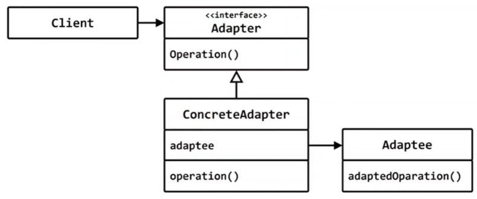
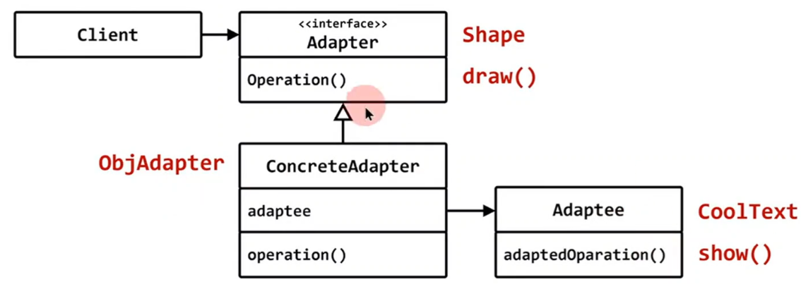

# Adapter

## 구조 패턴(structural pattern)

## 의도 (intent)
- 인터페이스플 클라이언트가 기대하는 형태의 인터페이스로 변환
  


## CoolText
- 문자열을 보관했다가 화면에 출력해주는 클래스
- 문자열을 이쁘게 출력할수 있는 다양한 기능을 제공
- 예전부터 가지고 있는 클래스

## 도형편집기 시스템에 Rect, Circle 외에 문자열 편집 출력하는 클래스를 추가하고 싶다.
- 예전부터 가지고 있던 CoolText를 사용할수 있을까?

## 도형편집기에서 사용하려면
- Shape 클래스로부터 상속 받아야 한다.
- draw() 함수를 제공해야 한다.

```c++
#include <iostream>
#include <string>
#include <vector>
#include "Shape.h"
#include "CoolText.h"

class ClsAdapter : public CoolText, public Shape 
{
public:
	ClsAdapter(const std::string& text) 
			: CoolText(text) {}
	void draw() override { CoolText::show();}
};	

int main()
{
	std::vector<Shape*> v;
	v.push_back( new ClsAdapter("Hello"));
	v[0]->draw();
}
```

## Adapter의 종류

|||
|--|--|
|클래스 어답터|클래스의 인터페이스를 변경|
|객체 어답터|객체의 인터페이스를 변경|


```c++
#include <iostream>
#include <string>
#include <vector>
#include "Shape.h"
#include "CoolText.h"

class ClsAdapter : public CoolText, public Shape 
{
public:
	ClsAdapter(const std::string& text) : CoolText(text) {}
	void draw() override { CoolText::show();}
};	

class ObjAdapter : public Shape 
{
	CoolText* ct;
public:
	ObjAdapter(CoolText* ct) : ct(ct) {}
	void draw() override { ct->show();}
};	

int main()
{
	std::vector<Shape*> v;
	CoolText ct("Hello");	// CoolText : 클래스
							// ct       : 객체

//	v.push_back( &ct ); 	// error
	v.push_back( new ObjAdapter( &ct)  );
	v[0]->draw();
}
```

# Adapter

## 구조 패턴(structural pattern)

## 의도 (intent)
- 인터페이스플 클라이언트가 기대하는 형태의 인터페이스로 변환
  



