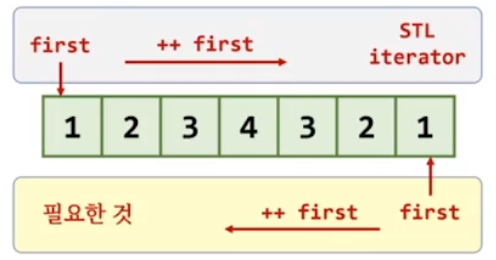

## std::find로 검색시 뒤에서부터 검색할수 없을까?
- std::find는 1번째 인자로 받는 반복자를 ++로 이동하면서 검색한다.

## 방법1. 거꾸로 동작하는 반복자를 새롭게 만들자
- vector뿐 아니라, list, deque 등 모든 컨테이너에 새로운 반복자를 만들어야 한다.

## 방법2. ++연산시 기존 반복자의 --연산을 수행하는 adapter를 만들자
- STL이 선택한 방법
- iterator adapter



```c++
#include <iostream>
#include <algorithm>
#include <vector>

int main()
{
	std::vector<int> s = {1,2,3,4,3,2,1};

//	auto first = s.begin();
//	auto last  = s.end();

//	std::reverse_iterator< std::vector<int>::iterator  > first(s.end());
	std::reverse_iterator first(s.end());
	std::reverse_iterator last(s.begin());
	auto ret = std::find(first, last, 3);
}
```

## std::reverse_iterator
- 기존 반복자의 동작을 거꾸로 수행하는 adapter
- ++ 연산시 기존 반복자의 -- 연산 수행
- C++17 이전 환경의 경우 템플릿 인자 전달

## 이외에도 STL에는 많은 iterator adapter가 존재
- cppreference.com 참고


