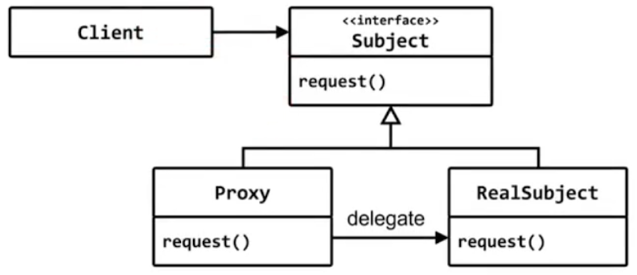
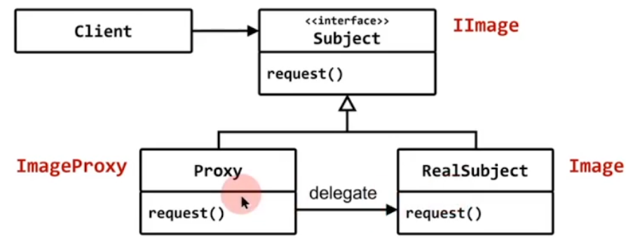

# proxy

## 구조 패턴 (structural pattern)

## 의도 (intent)
- 다른 객체에 접근하기 위해 중간 대리 역할을 하는 객체를 둔다
- 다양한 문제를 해결하기 위한 간접층



## Image
- 그림 파일을 load해서 관리하는 클래스

## Image를 그릴 필요는 없고, 크기 정보만 얻고 싶다
- 크기 정보는 그림 파일 전체를 메모리에 로드할 필요 없고,
- 그림 파일의 헤더 부분에서 읽어 올수 있다.

## 지연된 생성을 위한 대행자
- 필요한 경우(draw)만 객체를 생성하자

```c++
#include <iostream>
#include <string>


struct IImage
{
	virtual void draw() = 0;
	virtual int width() const = 0;
	virtual int height() const = 0;
	virtual ~IImage() {}
};

class Image : public IImage
{
	std::string name;
public:
	Image(const std::string& name) : name(name)
	{
		std::cout << "open " << name << '\n';
	}
	void draw() { std::cout << "draw " << name << '\n'; }
	int width()  const { return 100;}
	int height() const { return 100;}
};


class ImageProxy : public IImage
{
	std::string name;
	Image* img = nullptr;
public:
	ImageProxy(const std::string& name) : name(name) {}
	int width()  const { return 100;} // 파일헤더에서 정보 획득
	int height() const { return 100;} // 파일헤더에서 정보 획득
	void draw() 
	{
		if ( img == nullptr )
			img = new Image(name);

		img->draw();
	}
};
int main()
{
//	Image* img = new Image("C:\\a.png");
	IImage* img = new ImageProxy("C:\\a.png");
//	img->draw();

	int w = img->width();
	int h = img->height();
	img->draw();
}
```

- 지연된 생성
- 보안(이증)의 추가
- 기능의 추가(로그 추가)
- 원격지 서버에 대한 대행자
- bridge 패터, decorator 패터과 비슷


# proxy

## 구조 패턴 (structural pattern)

## 의도 (intent)
- 다른 객체에 접근하기 위해 중간 대리 역할을 하는 객체를 둔다
- 다양한 문제를 해결하기 위한 간접층


