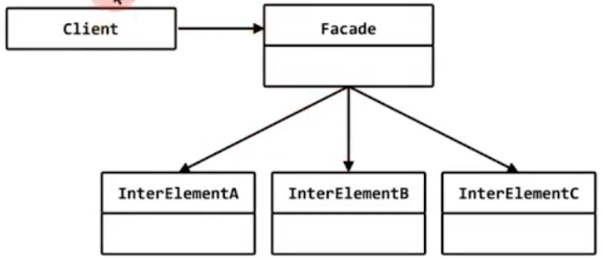
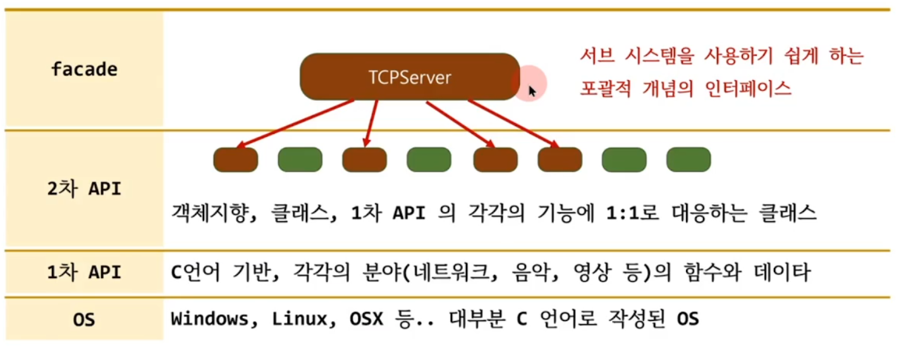
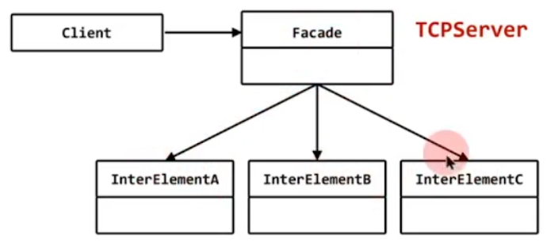

# facade

## 구조 패턴 (structural pattern)

## 의도 (intent)
- 서브 시스템을 합성하는 다수의 객체들의 인터페이스 집합에 대해 일관된 하나의 인터페이스를 제공할수 있게 한다. facade는 서브 시스템을 사용하기 쉽게하기 위한 포괄적 개념의 인터페이스를 정의한다.



## C 언어로 만든 TCP Server 프로그램
- C 언어는 데이터와 함수가 분리되어 있고 생성자/소멸자 등의 문법도 없다.
- 코드가 복잡해 보인다.

## 객체지향 프로그래밍
- 네트워크 프로그램에 사용되는 다양한 개념을 각각 클래스로 설계.

## TCP Server를 만들려면
- 몇개의 클래스를 사용해서 
- 몇가지의 절차를 거쳐야 한다.

## TCPServer 클래스
- TCP Sever를 만드는데 필요한 `일련을 절차에 대한 포괄적 개념의 인터페이스를 제공`하는 클래스
- 사용하기 쉽게 하기 위한 클래스

```c++
#define _WINSOCK_DEPRECATED_NO_WARNINGS
#include <WinSock2.h>
#pragma comment(lib, "ws2_32.lib")

class NetworkInit
{
public:
	NetworkInit()
	{
		WSADATA w;
		WSAStartup(0x202, &w);
	}
	~NetworkInit()
	{
		WSACleanup();
	}
};

class IPAddress
{
	SOCKADDR_IN addr;
public:
	IPAddress(const char* ip, short port)
	{
		addr.sin_family = AF_INET;
		addr.sin_port = htons(port);
		addr.sin_addr.s_addr = inet_addr(ip);
	}
	SOCKADDR* getRawAddress()
	{
		return (SOCKADDR*)&addr;
	}
};

class Socket
{
	int sock;
public:
	Socket(int type) { sock = socket(PF_INET, type, 0); }
	void Bind(IPAddress* ip)
	{
		::bind(sock, ip->getRawAddress(), sizeof(SOCKADDR_IN));
	}
	void Listen() { ::listen(sock, 5); }
	void Accept()
	{
		struct sockaddr_in addr2 = { 0 };
		int sz = sizeof(addr2);
		accept(sock, (SOCKADDR*)&addr2, &sz);
	}
};

class TCPServer
{
	NetworkInit init;
	Socket sock{SOCK_STREAM};
public:
	void Start(const char* ip, short port)
	{
		IPAddress addr(ip, port);
		sock.Bind(&addr);
		sock.Listen();
		sock.Accept();
	}
};

int main()
{
	TCPServer server;
	server.Start("127.0.0.1", 4000);
}
```

## facade



## 구조 패턴 (structural pattern)

## 의도 (intent)
- 서브 시스템을 합성하는 다수의 객체들의 인터페이스 집합에 대해 일관된 하나의 인터페이스를 제공할수 있게 한다. facade는 서브 시스템을 사용하기 쉽게하기 위한 포괄적 개념의 인터페이스를 정의한다.

