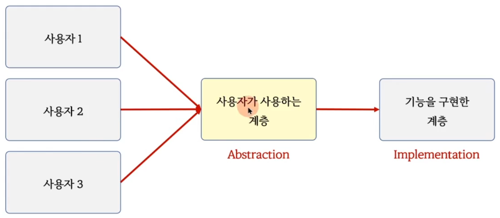
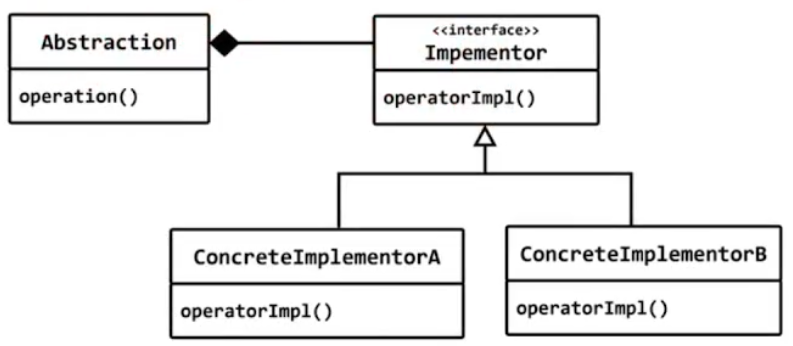
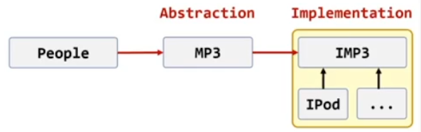
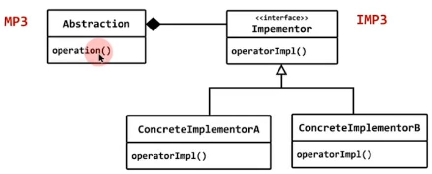

# bridge

 - 구현이 update되면 사용자 코드도 모두 변경되어야 한다.
 - 사용자와 상관없이 구현만 독립적으로 update할수 없을까?




- 간접층을 넣어서 구현과 추상을 독립적으로 update할수 있게하는 패턴


## 구조 패턴 (behavior pattern)

## 의도 (intent)
- 구현과 추상화 개념을 분리하여 각각을 독립적으로 변형할수 있게 한다.



## People이 IPod를 직적 사용하면
- 강한 결합
- 다른 제품으로 교체 불가능하다.

## People이 IMP3 인터페이스를 사용하면
- 약한 결합
- 다른 제품으로 교체 가능하다.

## 사용자가 새로운 기능을 요구하면
- IMP3 인터페이스가 수정되어야 한다.
- 인터페이스의 변경은 모든 제품을 변경을 의미

## IMP3 인터페이스가 변경되면
- 모든 사용자 코드가 변경되어야 한다.
- 사용자와 IMP3 구현의 update를 상호 독립적으로 만들수 없을까?



```c++
#include <iostream>

struct IMP3
{
	virtual void play() = 0;
	virtual void stop() = 0;

	virtual ~IMP3() {}
};

class IPod : public IMP3
{
public:
	void play() { std::cout << "Play MP3 with IPod" << std::endl; }
	void stop() { std::cout << "Stop" << std::endl; }
};

class MP3
{
	IMP3* impl; 
public:
	MP3(IMP3* p = nullptr) : impl(p)
	{
		if (impl == nullptr)
			impl = new IPod;
	}

	void play() { impl->play(); }
	void stop() { impl->stop(); }
	void play_one_minute()
	{
		impl->play();
		// 1분 후에.. 
		impl->stop();
	}
};

class People
{
public:
	void use(MP3* p) 
	{				  					  
		p->play();
		p->stop();		
		p->play_one_minute();
	}
};

int main()
{
	People p;
	MP3 mp3;
	p.use(&mp3);
}
```

## PIMPL
- C++ 진영에서 bridge 패턴을 나타내는 또 다른 용어
- Pointer to IMPLementation


# brideg
## 구조 패턴 (behavior pattern)

## 의도 (intent)
- 구현과 추상화 개념을 분리하여 각각을 독립적으로 변형할수 있게 한다.


