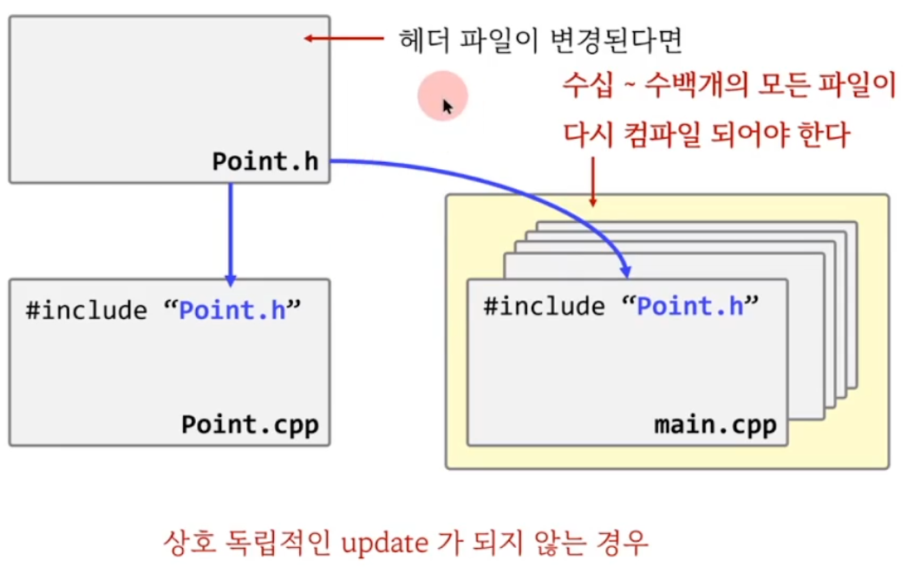
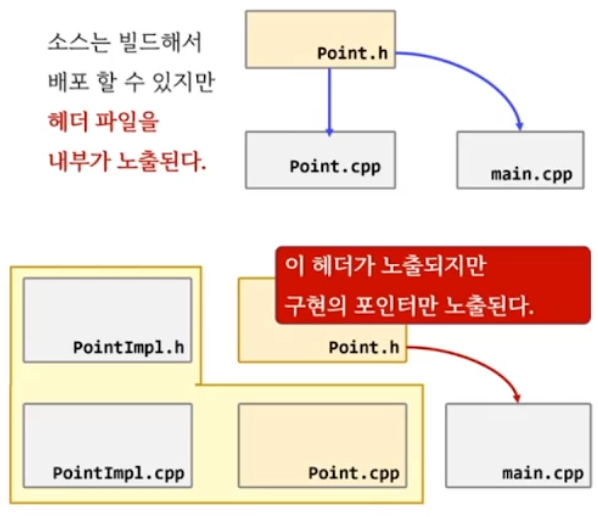

## PIMPL
- C++ 진영에서 bridge 패턴을 나타내는 또 다른 용어
- Pointer to IMPLementation

## C++ 진영에서 널리 사용되는 예제  
- class 전방 선언 사용



## PIMPL 기술의 장점
- 컴파일 속도가 빨리진다. (컴파일러 방화벽)
- 완벽한 정보 은닉을 할수 있다.




[point.h]
```c++
//#include "PointImpl.h"
class PointImpl; // 핵심.. 

class Point
{
	PointImpl* impl;
public:
	Point(int x, int y);
	void print() const;
};
```
[point.cpp]
```c++
#include "Point.h"
#include "PointImpl.h"

Point::Point(int x, int y) : impl( new PointImpl(x, y) ) {}
void Point::print() const
{ 
	impl->print(); 
}
```
[pointimpl.h]
```c++
class PointImpl
{
	int x, y;	
	int debug;
public:
	PointImpl(int x, int y);
	void print() const;
};
```

[pointimpl.cpp]
```c++
#include <iostream>
#include "PointImpl.h"

PointImpl::PointImpl(int x, int y)
	: x(x), y(y)
{
}

void PointImpl::print() const
{
	std::cout << x << ", " << y << std::endl;
} 
```


