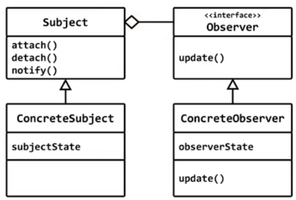
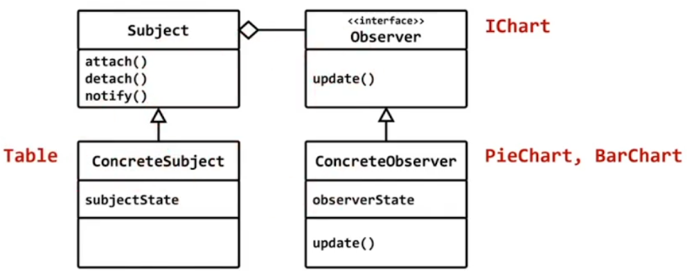

# observer

## 행위 패턴 (behavior pattern)

## 의도 (intent)
- 객체 사이의 `1:N의 종속성을 정의`하고 `한 객체의 상태가 변하면 종속된 다른 객체들에 통보가 가고 자동으로 수정`이 일어나게 한다.



## 테이블의 데이터가 변경되면 연결된 모든 차트가 수정되어야 한다.

## 방법1. 차트에서 루프를 돌면서 데이블이 변하는지 관찰한다.
- 차트가 여러 개 라면 모든 차트에서 루프를 돌면서 테이블을 관찰해야 한다.

## 방법2. 차트를 테이블에 등록하고 테이블이 수정되면 등록된 차트에 통보한다.
- observer 패턴의 핵심

1) 모든 chart의 공통의 인터페이스(IChart)가 필요하다.
2) 테이블에는 다양한 종류의 차트를 보관할수 있어야 한다. (std::vector<IChart*>)
3) 테이블에는 차트를 등록/등록취소 하는 함수가 있어야 한다.
4) 테이블에 있는 데이터에 변화가 생기면 등록된 모든 차트에 통보(약속된 함수 호출)을 해야 한다.

## 테이블이 관리하는 데이터의 형태가 변경되면
- 데이터를 편집하는 방법도 수정되어야 한다.
- 하지만, observer 패턴의 기본 로직을 제공하는 attach, detach, notify는 변경되지 않는다.
- 변경되지 않는 코드(observer 패턴의 기본 로직)을 제공하는 기반 클래스를 제공한다.

## subject
- 관찰의 대상의 기반 클래스
- observer 패턴의 기본 로직을 제공

```c++
#include <iostream>
#include <vector>

struct IChart
{
	virtual void update(int n) = 0;
	virtual ~IChart() {}
};

class Subject
{
	std::vector<IChart*> v;
public:
	virtual ~Subject() {}

	void attach(IChart* p) { v.push_back(p); }
	void detach(IChart* p) { }

	void notify(int data)
	{
		for (auto p : v)
			p->update(data);
	}
	
};

class Table : public Subject
{
	int data;
public:
	void edit()
	{
		while (1)
		{
			std::cout << "data >> ";			
			std::cin >> data; 
			notify(data);
		}
	}
};

class BarChart : public IChart
{
public:
	void update(int n) override
	{
		std::cout << "Bar Chart : ";

		for (int i = 0; i < n; i++)
			std::cout << "*";

		std::cout << std::endl;
	}
};

class PieChart : public IChart
{
public:
	void update(int n) override
	{
		std::cout << "Pie Chart : ";

		for (int i = 0; i < n; i++)
			std::cout << "(";

		std::cout << std::endl;
	}
};

int main()
{
	Table t;
	BarChart bc; t.attach(&bc);
	PieChart pc; t.attach(&pc);
	
	t.edit();	
}
```

# observer

## 행위 패턴 (behavior pattern)

## 의도 (intent)
- 객체 사이의 `1:N의 종속성을 정의`하고 `한 객체의 상태가 변하면 종속된 다른 객체들에 통보가 가고 자동으로 수정`이 일어나게 한다.



