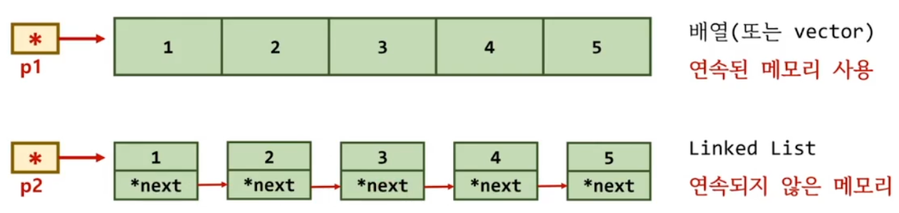
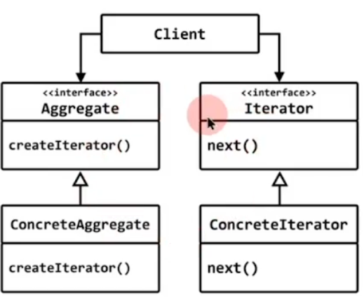

## C 언어를 사용해서 모든 요소를 순차적으로 접근하려면
- 컨테이너의 내부를 노출 (버퍼 시작 주소)
- 방법이 다르다. (++p1, p2 = p2->next)
- 사용자가 컨테이너의 구조를 알고 있어야 한다.

## C++ 언어(STL)를 사용하면
- 컨테이너의 내부 구조를 노출하지 않고도, 동일한 방법으로 모든 요소에 순차적으로 접근할수 있다.

# iterator 

## 행위 패턴 (behavior pattern)

## 의도 (intent)
- 복합 객체 요소들의 내부 표현 방식을 공개하지 않고도 순차적으로 접근할수 있는 방법을 제공한다.



## iterator 만드는 2가지 예제

1) interface 기반의 설계
   - 전통적인 디자인 패턴에서 설명되는 방식
   - java, C#, swift, python 등이 사용하는 방식

2) C++ STL 라이브러리가 사용하는 설계 방식
   - 성능 향상을 위한 기법

## linked list 코드 필요

```c++
template<typename T> struct Node
{
	T     data;
	Node* next;
	Node(const T& d, Node* n) : data(d), next(n) {}
};

template<typename T> struct slist
{
	Node<T>* head = nullptr;
public:
	void push_front(const T& a) 
	{ 
		head = new Node<T>(a, head); 
	}
};
int main()
{
	slist<int> s;
	s.push_front(10);
	s.push_front(20);
	s.push_front(30);
	s.push_front(40);
	s.push_front(50);
}
```
