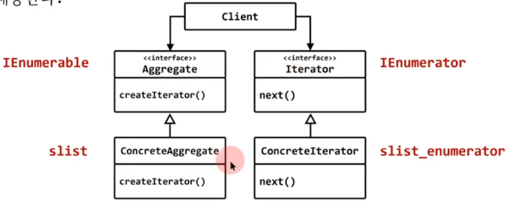

## STL 방식의 iterator

## 가상함수가 아닌 인라인 치환

## moveNext() 라는 이름 대신 `++` 연산자 재정의, getObject() 대신 `*` 연산자 재정의
- raw pointer와 동일한 방법으로 사용 가능하도록
- 편의성을 위한 `==`, `!=` 연산자도 재정의

## 반복자를 꺼내기 위해
- begin(), end() 함수 제공

## 기본적인 개념을 동일하지만 C++만의 특징을 적용

```c++
#include <iostream>

template<typename T> struct Node
{
	T     data;
	Node* next;
	Node(const T& d, Node* n) : data(d), next(n) {}
};

template<typename T> 
class slist_iterator
{
	Node<T>* current;
public:
	slist_iterator(Node<T>* p = nullptr)
		: current(p)
	{
	}

	inline T& operator*() { return current->data; }

	inline slist_iterator& operator++() 
	{
		current = current->next;
		return *this; 
	}

	inline bool operator==(const slist_iterator& other) const 
	{
		return current == other.current;
	}
	inline bool operator!=(const slist_iterator& other) const 
	{
		return current != other.current;
	}	
};

template<typename T> class slist 
{
	Node<T>* head = nullptr;
public:
	void push_front(const T& a) { head = new Node<T>(a, head); }

	inline slist_iterator<T> begin()
	{
		return slist_iterator<T>(head);
	}
	inline  slist_iterator<T> end()
	{
		return slist_iterator<T>(nullptr);
	}
};

int main()
{
	slist<int> s;
	s.push_front(10);
	s.push_front(20);
	s.push_front(30);
	s.push_front(40);
	s.push_front(50);

	auto first = s.begin();
	auto last = s.end();

	while( first != last )
	{
		std::cout << *first << std::endl;
		++first;
	}
}
```

# iterator 

## 행위 패턴 (behavior pattern)

## 의도 (intent)
- 복합 객체 요소들의 내부 표현 방식을 공개하지 않고도 순차적으로 접근할수 있는 방법을 제공한다.



