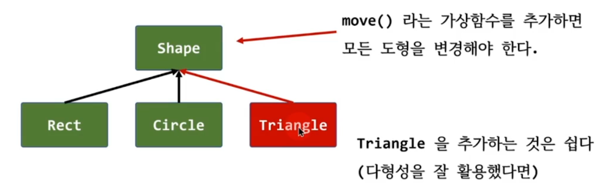
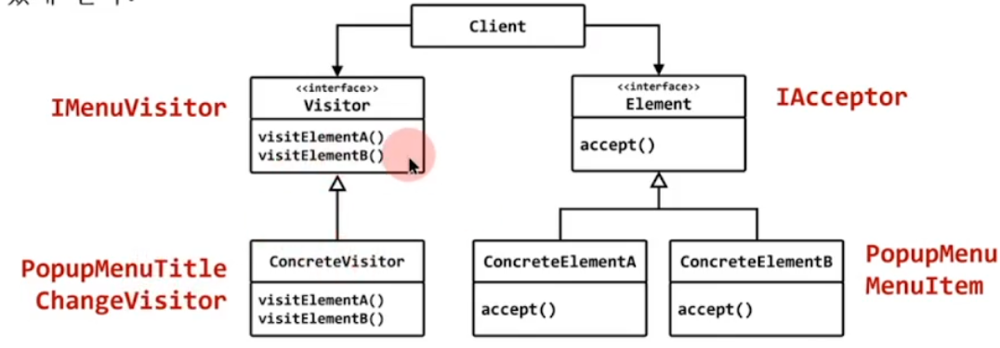

## list
- 모든 요소의 타입이 동일(int)하다.
- 모든 요소가 선형적인 형태로 보관

## Menu
- 요소의 타입이 다양하다.(MenuItem, PopupMenu)
- tree 구조로 보관되어 있다.

```c++
#include <iostream>
#include <string>
#include <vector>
#include <conio.h> 

class MenuItem;
class PopupMenu;  

struct IMenuVisitor
{
	virtual void visit(MenuItem* mi) = 0;
	virtual void visit(PopupMenu* pm) = 0;
	virtual ~IMenuVisitor() {}
};

struct IAcceptor
{
	virtual void accept(IMenuVisitor* visitor) = 0;
	virtual ~IAcceptor() {}
};

//---------------------------------------------

class BaseMenu : public IAcceptor
{
	std::string title;
public:
	BaseMenu(const std::string& title) : title(title) {}
	virtual ~BaseMenu() {}
	std::string get_title() const { return title; }
	void set_title(const std::string& s) { title = s; }
	virtual void command() = 0;
};

class MenuItem : public BaseMenu
{
	int id;
public:
	MenuItem(const std::string& title, int id) : BaseMenu(title), id(id) {}
	void accept(IMenuVisitor* visitor)
	{
		visitor->visit(this);
	}
	void command() override
	{
		std::cout << get_title() << " 메뉴가 선택됨" << std::endl;
		_getch();
	}
};

class PopupMenu : public BaseMenu
{
	std::vector<BaseMenu*> v;
public:

	PopupMenu(const std::string& title) : BaseMenu(title) {}
	void accept(IMenuVisitor* visitor)
	{
		visitor->visit(this);

		for ( auto child : v)
			//visitor->visit(child);
			child->accept(visitor); // 
	}

	void add_menu(BaseMenu* p) { v.push_back(p); }
	void command() override
	{
		while (1)
		{
			system("cls");

			int sz = v.size();

			for (int i = 0; i < sz; i++)
			{
				std::cout << i + 1 << ". " << v[i]->get_title() << std::endl;
			}

			std::cout << sz + 1 << ". 종료" << std::endl;

			int cmd;
			std::cout << "메뉴를 선택하세요 >> ";
			std::cin >> cmd;

			if (cmd < 1 || cmd > sz + 1)
				continue;

			if (cmd == sz + 1)
				break;

			v[cmd - 1]->command(); 
		}
	}
};

class PopupMenuTitleChangeVisitor : public IMenuVisitor
{
public:
	void visit(MenuItem* mi) {}  // 메뉴아이템 방문시 할일은 없다.
	void visit(PopupMenu* pm) 
	{
		std::string s = "[ " + pm->get_title() + " ]";
		pm->set_title(s);
	}
};

int main()
{
	PopupMenu* root = new PopupMenu("ROOT");
	PopupMenu* pm1 = new PopupMenu("해상도 변경");
	PopupMenu* pm2 = new PopupMenu("색상 변경");

	root->add_menu(pm1);
	root->add_menu(pm2);

	pm1->add_menu(new MenuItem("HD", 11));
	pm1->add_menu(new MenuItem("FHD", 12));
	pm1->add_menu(new MenuItem("UHD", 13));

	pm2->add_menu(new MenuItem("RED", 21));
	pm2->add_menu(new MenuItem("GREEN", 22));
	pm2->add_menu(new MenuItem("BLUE", 23));

	PopupMenuTitleChangeVisitor v; 
	root->accept(&v);
	root->command();
}
```

# visitor의 의미

## 객체지향 디자인의 특징
- 새로운 요소(타입)을 추가 : 쉽다.
- 새로운 오퍼레이션(가상함수)의 추가: 어렵다.



## 가상함수를 추가하지말고 가상함수가 할일을 방문자로 만들면?

## Visitor 패턴을 사용하면
- 새로운 요소(타입)을 추가 : 어렵다.
- 새로운 오퍼레이션(가상함수)의 추가: 쉽다.


# visitor

## 행위 패턴 (Behavior pattern)

## 의도 (intent)
- 객체 구조에 속한 요소에 수행될 오퍼레이션을 정의하는 객체
- visitor 패턴은 처리되어야 하는 요소에 대한 클래스를 변경하지 않고 새로운 오퍼레이션을 정의할수 있게 한다.



