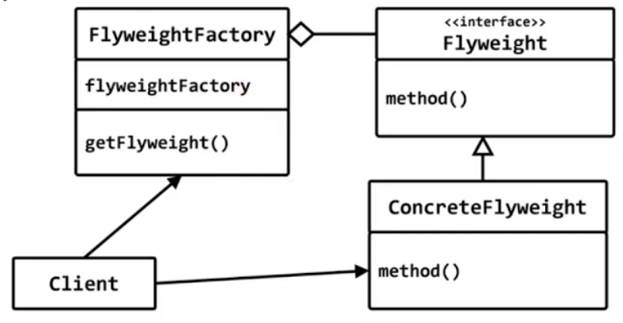

# flyweight
## 구조 패턴 (structural pattern)

## 의도 (intent)
- 속성이 동일한 객체를 공유하게 한다.



## Image 클래스
- 그림을 그리는 클래스
- 파일 또는 인터넷에서 다운로드 하는 기능 지원

## flyweight 패턴
- 속성이 동일하면 공유하게 하자
- 동일한 그림을 관리하는 객체를 2개 만들 필요없다.

```c++
#include <iostream>
#include <string>
#include <map>

class Image
{
	std::string image_url;

	Image(const std::string& url) : image_url(url)
	{
		std::cout << url << " Downloading...\n";
	}
public:

	void draw() 
	{ 
		std::cout << "draw " << image_url << '\n';
	}
	
	static std::map<std::string, Image*> image_map;
	static Image* create(const std::string& url)
	{
		Image* img;
		auto ret = image_map.find(url);
		
		if (ret == image_map.end())
		{
			img = new Image(url);
			image_map[url] = img;
		}
		return image_map[url];
	}
};
std::map<std::string, Image*> Image::image_map;

int main()
{
	Image* img1 = Image::create("www.image.com/a.png");
	img1->draw();

	Image* img2 = Image::create("www.image.com/a.png");
	img2->draw();
}
```
[factory 사용하는 예제]
```c++
#include <iostream>
#include <string>
#include <map>

class Image
{
	std::string image_url;

	Image(const std::string& url) : image_url(url)
	{
		std::cout << url << " Downloading...\n";
	}
public:
	void draw() 
	{ 
		std::cout << "draw " << image_url << '\n';
	}
	friend class ImageFactory;
};

class ImageFactory
{
	std::map<std::string, Image*> image_map;
public:
	Image* create(const std::string& url)
	{
		Image* img;
		auto ret = image_map.find(url);
		
		if (ret == image_map.end())
		{
			img = new Image(url);
			image_map[url] = img;
		}
		return image_map[url];
	}
};

int main()
{
	ImageFactory factory;

	Image* img1 = factory.create("www.image.com/a.png");
	img1->draw();

	Image* img2 = factory.create("www.image.com/a.png");
	img2->draw();
}
```


