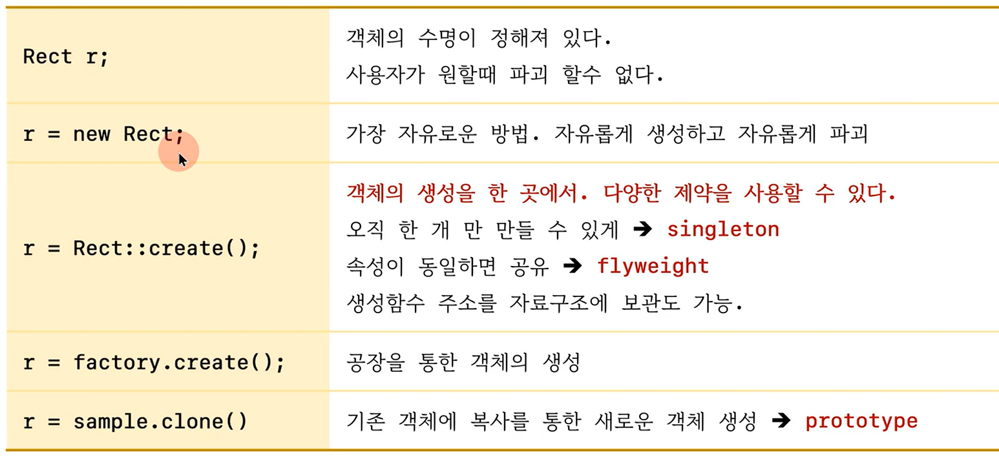

# prototype

## 생성 패턴(creational pattern)

## 의도 (intent)
- 견본적(prototypical) 인스턴스를 사용하여 생성할 객체의 종류를 명시하고 이렇게 만들어진 견본을 복사하여 새로운 객체를 생성한다.


## prototype.cpp
- fatory2.cpp 복사해서 사용
- `factory.register_shape(1, &Rect::create);`
- Factory <== Rect, Circle 등의 클래스를 등록 (정확히는 생성함수를 등록)
- Factory <== 클래스가 아닌 자주 사용하는 객체를 등록

```c++
#include <iostream>
#include <vector>
#include <map>
#include "singleton.h"

class Shape
{
public:
	virtual void draw() = 0;
	virtual Shape* clone() = 0;
	virtual ~Shape() {}
};

class Rect : public Shape
{
public:
	void draw() override { std::cout << "draw Rect" << std::endl; }
	Shape* clone() override { return new Rect(*this);}
	static Shape* create() { return new Rect; }
};

class Circle : public Shape
{
public:
	void draw() override { std::cout << "draw Circle" << std::endl; }
	Shape* clone() override { return new Circle(*this);}
	static Shape* create() { return new Circle; }
};

class ShapeFactory
{
	MAKE_SINGLETON(ShapeFactory)

	std::map<int, Shape*> prototype_map; 
public:
	void register_sample(int key, Shape* sample)
	{
		prototype_map[key] = sample;
	}

	Shape* create(int type)
	{
		Shape* p = nullptr;

		if (prototype_map[type] != nullptr)
		{
			p = prototype_map[type]->clone(); 
		}
		return p;
	}
};

int main()
{
	std::vector<Shape*> v;
	ShapeFactory& factory = ShapeFactory::get_instance();

//	factory.register_shape(1, &Rect::create);
//	factory.register_shape(2, &Circle::create);

	Rect* red_rect = new Rect; 
	Rect* blue_rect = new Rect; 
	Circle* blue_circle = new Circle;

	factory.register_sample( 1, red_rect);
	factory.register_sample( 2, blue_rect);
	factory.register_sample( 3, blue_circle);

	while (1)
	{
		int cmd;
		std::cin >> cmd;

		if (cmd > 0 && cmd < 8)
		{
			Shape* s = factory.create(cmd);

			if ( s )
				v.push_back(s);
		} else if (cmd == 9)
		{
			for (auto s : v)
				s->draw();
		}
	}
}
```

# prototype

## 생성 패턴(creational pattern)

## 의도 (intent)
- 견본적(prototypical) 인스턴스를 사용하여 생성할 객체의 종류를 명시하고 이렇게 만들어진 견본을 복사하여 새로운 객체를 생성한다.


## 객체를 생성하는 방법



