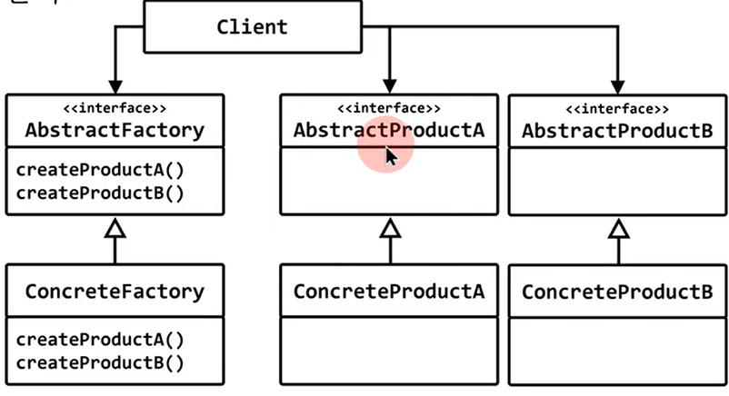
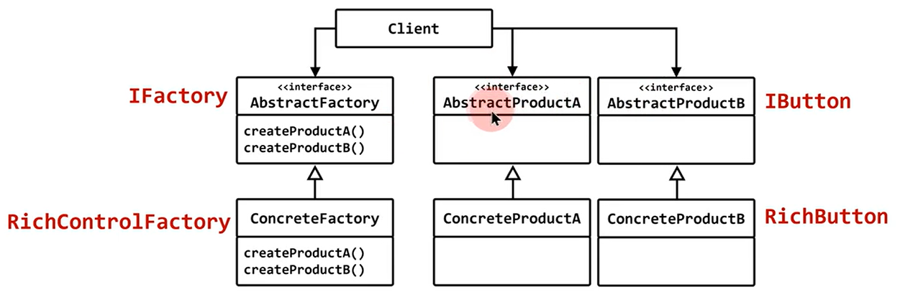

# abstract factory

## 생성 패턴 (creational pattern)

## 의도 (intent)
- 상세화된 서브 클래스를 정의하지 않고도 서로 관련성이 있거나 독립적인 여러객체의 군을 생성하기 위한 인터페이스를 제공한다.
  


## GUI 라이브러리 안에 2가지 종류의 컨트롤 클래스 제공
|||
|--|--|
|RichButten<br>RichEdit<br>Rich...|이쁘고 화려하지만, 메모리 사용량이 많고, 성능이 좋지 않음. 고성능의 시스템에 적합|
|SimpleButten<br>SimpleEdit<br>Simple...|단순하고, 이쁘지 않지만 메모리 사용량이 적고 빠르게 동작|


## 사용자가 옵션으로 종류를 선택(변경) 가능.
- 각 컨트롤마다 인터페이스가 필요하다.

```c++
#include <iostream>
#include <cstring>

struct IButton
{
	virtual void draw() = 0;
	virtual ~IButton() {}
};
struct IEdit
{
	virtual void draw() = 0;
	virtual ~IEdit() {}
};

struct RichButton : public IButton
{
	void draw() { std::cout << "draw RichButton" << std::endl; }
};
struct RichEdit : public IEdit
{
	void draw() { std::cout << "draw RichEdit" << std::endl; }
};

struct SimpleButton : public IButton
{
	void draw() { std::cout << "draw SimpleButton" << std::endl; }
};
struct SimpleEdit : public IEdit
{
	void draw() { std::cout << "draw SimpleEdit" << std::endl; }
};

struct IControlFactory
{
	IButton* create_button()= 0;
	IEdit*   create_edit()  = 0;
	virtual ~IControlFactory() {}
};

class RichControlFactory : public IControlFactory
{
public:
	IButton* create_button() { return new RichButton; }
	IEdit*   create_edit() { return new RichEdit; }	
};

class SimpleControlFactory : public IControlFactory
{
public:
	IButton* create_button() { return new SimpleButton; }
	IEdit*   create_edit() { return new SimpleEdit; }
};

int main(int argc, char** argv)
{
	IControlFactory* factory;

	if (strcmp(argv[1], "-style:rich") == 0)
		factory = new RichControlFactory;
	else
		factory = new SimpleControlFactory;

	IButton* btn = factory->create_button();	
	btn->draw();
}
```

# abstract factory

## 생성 패턴 (creational pattern)

## 의도 (intent)
- 상세화된 서브 클래스를 정의하지 않고도 서로 관련성이 있거나 독립적인 여러객체의 군을 생성하기 위한 인터페이스를 제공한다.
  

