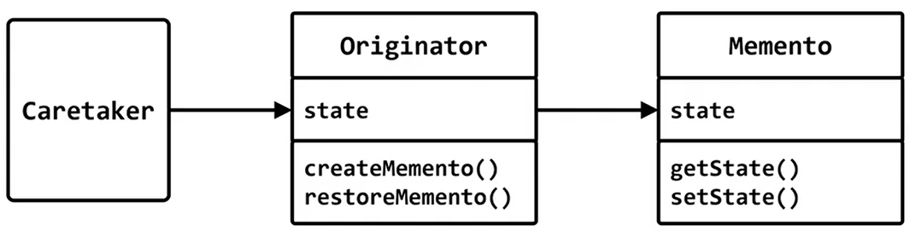
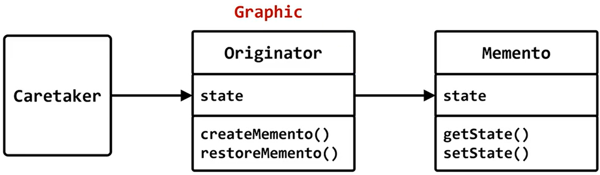

# memento

## 행위 패턴 (behavior pattern)

## 의도 (intent)
- 캡슐화를 위배하지 않고 객체 내부 상태를 캡슐화해서 저장하고, 나중에 객체가 이상태로 복구 가능하게 한다.



## Graphic 클래스
- 윈도우에 그림을 그릴때 사용하는 많은 함수들을 제공

## 선을 그릴때 선의 색생이나 두께 등을 변경하고 싶다.
- 방법1. 함수인자로 전달
- 방법2. Graphic 객체의 속성으로 지정


## memento 패턴
- 객체의 내부상태를 저장했다가 복구할수 있게 한다.
- 객체가 스스로를 저장했다가 복구하므로 캡슐화를 위배하지 않는다.

```c++
#include <iostream>
#include "graphic.h"

int main()
{
	Graphic g;

	g.set_stroke_color(red);
	g.set_stroke_width(10);
	g.draw_line(0, 0, 100, 100);
	g.draw_line(0, 0, 200, 200); 
	
	int token = g.save();

	g.set_stroke_color(blue);
	g.set_stroke_width(20);
	g.draw_line(0, 0, 300, 300);
	g.draw_line(0, 0, 400, 400);

	// 처음 그렸던 선과 동일한 속성으로 그리고 싶다. 
	g.restore(token);

	g.draw_line(10, 20, 300, 300);
	g.draw_line(10, 30, 400, 400);
}
```

```c++
#pragma once
#include <map>

enum color { red = 1, green = 2, blue = 3};

class Graphic
{
	struct Memento
	{
		int penWidth;
		int penColor;
		Memento(int w, int c) : penWidth(w), penColor(c) {}
	};
	std::map<int, Memento*> memento_map; 
	int penWidth = 1;
	int penColor = 0;
	int temporary_data;
public:

	int save()
	{
		static int key = 0;
		++key;
		Memento* p = new Memento(penWidth, penColor);
		memento_map[key] = p;
		return key;
	}
	
	void restore(int token)
	{
		penColor = memento_map[token]->penColor;
		penWidth = memento_map[token]->penWidth;
	}

	void draw_line(int x1, int y1, int x2, int y2)
	{
	}
	void set_stroke_color(int c) { penColor = c; }
	void set_stroke_width(int w) { penWidth = w; }
};
```

# memento

## 행위 패턴 (behavior pattern)

## 의도 (intent)
- 캡슐화를 위배하지 않고 객체 내부 상태를 캡슐화해서 저장하고, 나중에 객체가 이상태로 복구 가능하게 한다.


