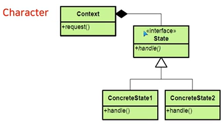
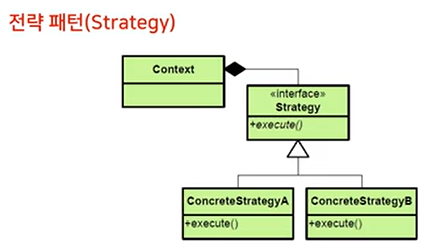

## item에 따른 조건 분기 (if, switch)
- 모든 동작 함수에 조건 분기문이 필요하다.
- 새로운 아이템 추가시 모든 동작함수에 분기문이 추가된다.

## 방법2. 변하는 것을 가상함수로
- 모든 동작을 가상 함수화 한다.
- 아이템 획득시의 동작 변경을 파생 클래스에서 재정의 한다.
- 기존 객체의 동작이 변경된 것이 아니라 동작이 변경된 새로운 객체가 생성된 것
- 객체에 대한 변화가 아닌 클래스에 의한 변화

## 변화는 것을 분리하는 방법
- 변화는 것을 가상함수로 분리한다.
- 변화는 것을 다른 클래스로 분리한다.

## 방법3. 상태에 따라 변경되는 동작들을 다른 클래스로 분리한다.
- 동작의 인터페이스를 정의한다.
- item에 따른 run(), attac() 함수의 동작을 정의한 클래스를 별도로 제공한다.
- 객체의 속성은 유지하지만 동작을 변경할수 있다.
- 클래스가 아닌 객체에 대한 변화

# State Pattern
## 객체 자신의 내부 상태에 따른 행위(동작)을 변경하도록 한다. 객체는 마치 클래스를 바꾸는 것처럼 보인다.

[state pattern]

[strategy pattern]

- 다양한 알고리즘이 존재하면 이들 각각을 하나의 클래스로 캡슐화하여 알고리즘의 대체가 가능하도록 한다.

