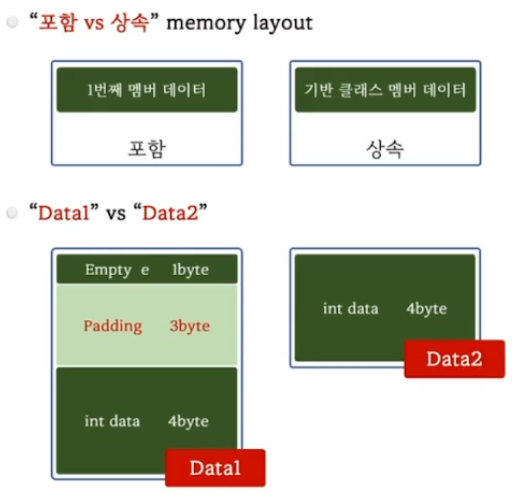

```c++
#include <iostream>

struct Empty {};

// Empty 를 1번째 멤버로 포함하는 경우
struct Data1
{
    Empty e;    
    int   data;
};

// Empty 로 부터 상속 받는 경우
struct Data2 : public Empty
{
    int   data;  
};

int main()
{
    std::cout << sizeof(Data1) << std::endl; // 8
    std::cout << sizeof(Data2) << std::endl; // 4
}
```


## Empty Base Class Optimization
- Empty Class로부터 상속을 받는 경우 기반 클래스인 Empty Class 크기는 0 byte로 최적화 된다.

```c++
#include <iostream>
#include <type_traits>

class Empty {};

template<typename T1, typename T2, bool = std::is_empty_v<T1> > struct PAIR;

template<typename T1, typename T2> struct PAIR<T1, T2, false>
{
    T1 first;
    T2 second;
};

template<typename T1, typename T2> 
struct PAIR<T1, T2, true> : public T1
{
    T2 second;
};

int main()
{    
    PAIR<int,   int> p1;
    PAIR<Empty, int> p2;    

    std::cout << sizeof(p1) << std::endl; // 8
    std::cout << sizeof(p2) << std::endl; // 4
}
```

## PAIR가 Empty를 보관할때 크기를 최적화 할수 없을까?
- Empty를 포함하지 말고 상속 받으면 크기를 줄일수 있다.

## boost::compressed_pair
- EBCO 기술을 이용해서 empty class 저장시 크기를 최적화한 pair


