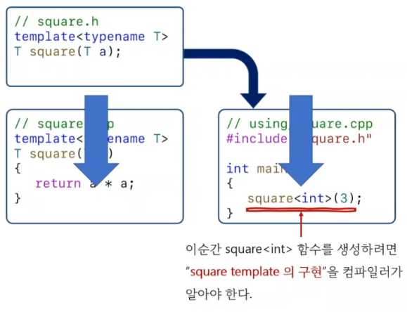

<style>
r { color: Red }
o { color: Orange }
g { color: Green }
</style>

# template 기본 문접
## 함수 템플릿을 만드는 방법
```c++
// typename or class 사용
template<typename T> 
T square1(T a)
{
	return a * a;
}
template<class T> 
T square2(T a)
{
	return a * a;
}

// C++20부터
auto square3(auto a) 
{
	return a * a;
}
int main()
{
	square1<int>(3);
	square2<int>(3);
	square3<int>(3);

	square1(3);
	square2(3);
	square3(3);
}
```

## 함수 템플릿을 사용하는 방법
|||
|--|--|
|템플릿 인자를 명시적으로 전달|square<int>(3);<br>사용자가 전달한 타입으로 함수를 생성|
|템플릿 인자를 생략|square(3);<br>컴파일러가 함수 인자를 보고 타입을 추론(type deduction)|

## 함수와 함수 템플릿
|||
|--|--|
|square|함수가 아니라 함수 템플릿이다.<br>square의 주소는 구할수 없다.|
|square<타입>|함수이다.<br>square<타입>의 주소는 구할수 있다.|
 
## template과 파일 분할
- 템프릿은 구현부를 헤더 파일에 작성해야 한다.
  

## template에 대한 다양한 관점
- 함수(클래스)를 생성하는 틀(template)
- a family of funtions(class)
- generic fuctions(class)

## template의 종류
- function template
- class template
- variable template
- using template (template alias)


