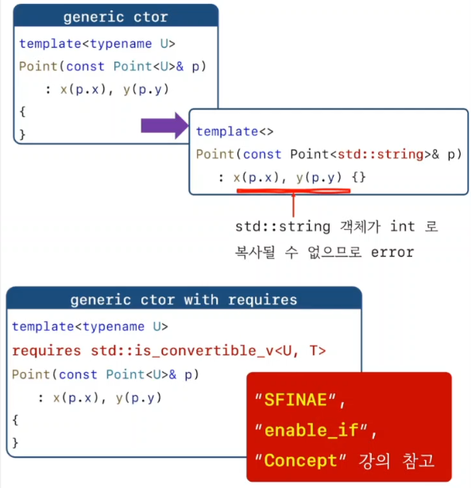

<style>
r { color: Red }
o { color: Orange }
g { color: Green }
</style>

## member function template


## 멤버함수 템플릿의 외부 구현 모양
```c++
template<typename T>
class Object
{
public:
	void mf1(int n) {}
	void mf2(T   n) {}

	template<typename U> 
	void mf3(U n);
};

// 멤버 함수 템플릿의 외부 구현, 복잡.
template<typename T> template<typename U> 
void Object<T>::mf3(U n)
{

}

int main()
{
	Object<int>    obj1;
	Object<double> obj2;

	obj1.mf1(3);
	obj2.mf1(3);

	obj1.mf2(3);
	obj2.mf2(3.4);

	obj1.mf3(3);
	obj1.mf3(3.4);
}
```

## Coercion by Member Template
- T 가 U로 복사(대입) 가능하면 
- Point<T>도 Point<U>로 복사(대입) 가능해야 한다.

```c++
template<typename T>
class Point
{
	T x, y;
public:
	Point(const T& a, const T& b) : x(a), y(b) {}

//	Point(const Point& p) {}
//	Point(const Point<T>& p) {}
//	Point(const Point<int>& p) {}

	template<typename U>
	Point(const Point<U>& p) : x(p.x), y(p.y) {}

	template<typename> friend class Point;
};

int main()
{
	Point<int> p1(1, 2);  // ok
	Point<int> p2 = p1;   // ok

	Point<double> p3 = p1;// ?? 

}
```



