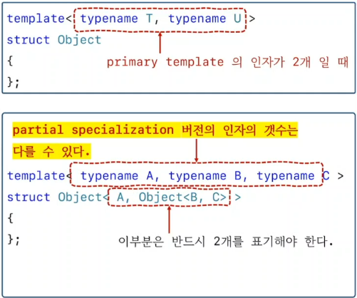

<style>
r { color: Red }
o { color: Orange }
g { color: Green }
</style>

## template specialization
```c++
// primary template
template<typename T> class Vector {}

// specialization (특수화, 전문화)
template<> class Vector<bool> {}

// partial specialization (부분 특수화, 부분 전문화)
template<typename T> class Vector<T*> {}
```

```c++
#include <iostream>

template<typename T> class Vector
{
	T*  ptr;
	std::size_t size;
public:
	Vector(std::size_t sz) : size(sz)
	{
		 ptr = new T[sz];
	}
	~Vector() { delete[] ptr;}
};

template<> class Vector<bool>
{
	int*  ptr;
	std::size_t size;
public:
	Vector(std::size_t sz) : size(sz)
	{
		 ptr = new int[(sz/32) + 1];
	}
	~Vector() { delete[] ptr;}
};


template<typename T> class Vector<T*>
{
	T*  ptr;
	std::size_t size;
public:
	Vector(std::size_t sz) : size(sz)
	{
		 ptr = new T[sz];
	}
	~Vector() { delete[] ptr;}
};


int main()
{
	Vector<int>    v1(5);
	Vector<double> v2(5);
	Vector<bool>   v3(5);
}
```

## template spcialization 

- partial specialization 버전의 인자의 갯수는 다를 수 있다.
- 그러나, primary template의 인자의 갯수는 반드시 동일하게 표시해야 한다.

```c++
#include <iostream>

template<typename T, typename U> struct Object
{
	static void fn() { std::cout << "T, U" << std::endl; }
};

// specialization(특수화)
template<> struct Object<int, short>
{
	static void fn() { std::cout << "int, short" << std::endl; }
};

template<typename T, typename U> struct Object<T*, U>
{
	static void fn() { std::cout << "T*, U" << std::endl; }
};

template<typename T> struct Object<T, T>
{
	static void fn() { std::cout << "T, T" << std::endl; }
};

template<typename U> struct Object<int, U>
{
	static void fn() { std::cout << "int, U" << std::endl; }
};

template<typename A, typename B, typename C> struct Object<A, Object<B, C>>
{
	static void fn() { std::cout << "A, Object<B, C>" << std::endl; }
};

int main()
{
	Object<char, double>::fn();	  // T, U
	Object<int,  short>::fn();	  // int, short
	Object<short*, double>::fn(); // T*, U
	Object<float,  float>::fn();  // T, T
	Object<int,    float>::fn();  // int, U

	Object<long, Object<char, short>>::fn(); // A, Object<B, C>
}
```