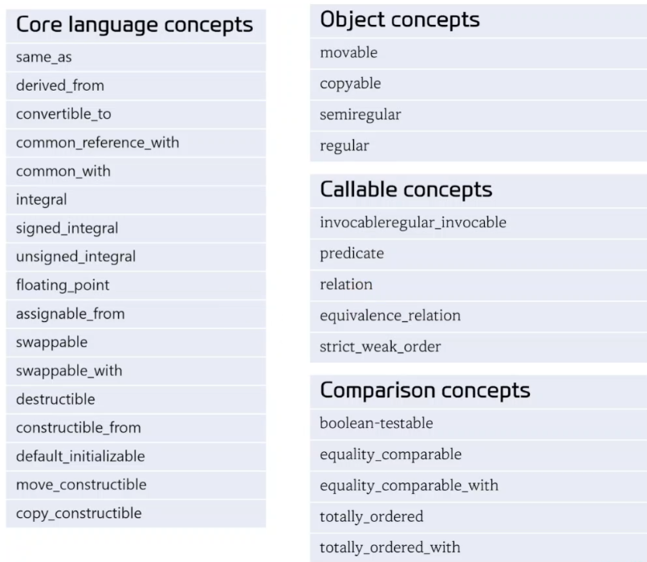
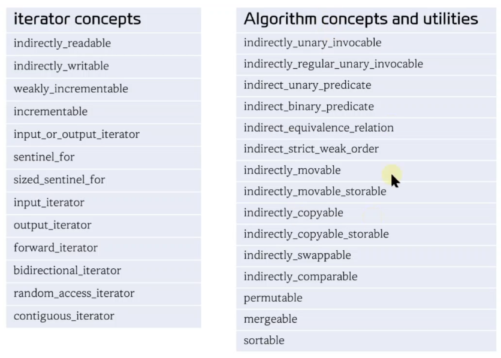
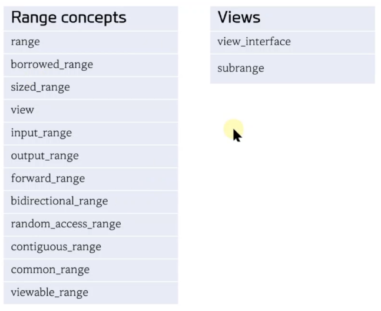

<style>
r { color: Red }
o { color: Orange }
g { color: Green }
</style>

## Standard Concept
|||
|--|--|
|`<concepts>`|Core language concept|
|`<iterator>`|반복자 및 알고리즘 관련 concept|
|`<ranges>`|Range 관련 concept|


## `<concepts>`



## `<iterator>`


## `<ranges>`



```c++
#include <iostream>
#include <algorithm>
#include <iterator>

// T2가 인자로 T1::value_type 받을 수 있는 함수인 경우
template<typename T1, typename T2> requires std::predicate<T2, typename std::iterator_traits<T1>::value_type>
// template<typename T1, typename T2> requires std::predicate<T2, typename std::iter_value_t<T1>>
T1 find(T1 first, T1 last, T2 pred)
{
    std::cout << "predicate version" << std::endl;
    return first;
}

// value version
template<typename T1, typename T2> requires (!std::predicate<T2, typename std::iterator_traits<T1>::value_type>)
T1 find(T1 first, T1 last, T2 pred)
{
    std::cout << "value version" << std::endl;
    return first;
}

template<typename T1, typename T2> 
T1 find(T1 first, T1 last, T2 pred)
{
    std::cout << "predicate version" << std::endl;
    return first;
}

int main()
{
    int x[10]{1,3,5,7,9,2,4,6,8,10};
    
    auto p1 = find(std::begin(x), std::end(x), 3);
    // auto p2 = std::find_if(std::begin(x), std::end(x), [](int n){ return n % 2 == 0;}]);
    auto p2 = find(std::begin(x), std::end(x), [](int n){ return n % 2 == 0;}]);
}
```
