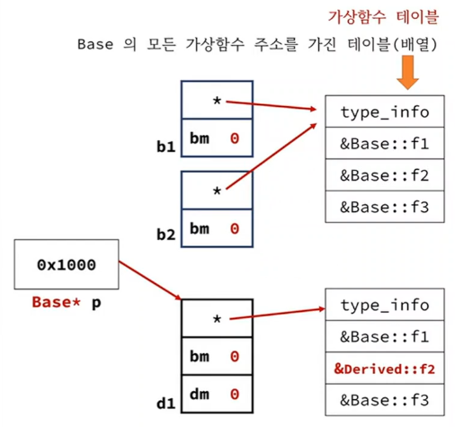

<style>
r { color: Red }
o { color: Orange }
g { color: Green }
</style>

```c++
class Base
{
    int data1;
public:
    void f1()         {}
    virtual void f2() {}
    virtual void f3() {}
    virtual void f4() {}    
};

class Derived : public Base
{
    int data2;
public:
    void f1()         {}
    virtual void f2() {}    
};

int main()
{
    Base    base1;
    Derived derv1;
    
    Base* p = &derv1;
    
    // p->f1(); // Base::f1
    p->f2(); // Derived::f2  
}
```

# `p->f2()` 코드는 어느 함수를 호출할 것인가?

## 가상함수가 아닌 경우
- 컴파일 시간에 p의 타입으로 호출을 결정
- p는 Base*이므로 Base::f2

## 가상함수인 경우
- 실행시간에 <r>p가 가리키는 메모리를 조사</r>해서 호출을 결정
- p가 Derived 객체를 가리키므로 Derived::f2 호출

## p가 가리키는 객체가 <r>어떤 타입인지 어떻게 조사</r>할수 있을까?
- 실행시간에 함수 호출을 결정하려면 <r>함수 주소를 알아야 한다.</r>

## 가상함수 호출 원리 => C++ 표준의 공식적인 내용은 아님
- 가상함수의 원리는 컴파일러마다 다를수 있고, 컴파일러 버전에 따라 다를수도 있음.
- 강의에서 설명하는 내용은 많은 컴파일러들이 사용하는 대표적인 원리임

## 가상함수 호출 원린



- 각 객체는 가상함수 테이블 + 할당된 변수 메모리로 구성됨
- 가상 함수 호출시 가상함수 테이블에서 찾음

## 가상함수가 선언된 순서를 가지고 검색
- f2는 2번째 선언된 가상함수이므로 가상함수 테이블에서 2번째 항목 주소를 꺼내서 호출

## 가상함수 오버헤드
- 클래스당 한개의 가상함수 테이블 생성
- 객체당 한개의 가상함수 테이블을 가리키는 포인터 멤버 추가
- 가상함수 호출시 주소를 꺼내서 호출하므로 약간의 지연
  - 인라인 치환이 될수 없다.
