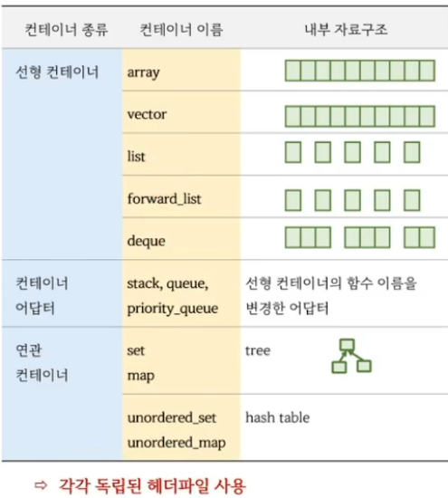

<style>
r { color: Red }
o { color: Orange }
g { color: Green }
</style>

## 컨테이너(Container) 란?
- vector, list, stack 등 여러 개의 값(객체)를 보관하는 클래스(템플릿)
- 자료구조를 클래스(템플릿)으로 설계한 것



## 컨테이너 사용시 C++17부터는 초기값이 있다면 타입 인자를 생략할수 있다.
|||
|--|--|
|C++ 14까지|std::vector<int> v = {1, 2, 3};|
|C++ 17이후|std::vector v = {1, 2, 3};|

```c++
#include <vector>

int main()
{
	// 1. C++17 부터는 초기값이 있는 경우 타입 인자 생략 가능
	std::vector<int> v1 = {1, 2, 3, 4, 5};
	std::vector      v2 = {1, 2, 3, 4, 5}; // C++17 부터 가능

	// 2. 초기값이 없는 경우는 반드시 타입인자를 전달해야 한다.
	std::vector      v3; // error
	std::vector<int> v4; // ok

	std::vector      v5(10, 3); // 10개를 3으로 초기화, 타입인자 생략가능
	std::vector<int> v6(10);	// 타입 인자 필요


	// 3. () 와 {} 를 주의 할것
	std::vector v7(10, 3); // 10개를 3으로 초기화
	std::vector v8{10, 3}; // 2개를 10, 3으로 초기화, 아래 코드와 동일
	std::vector v9 = {10, 3}; // 
}
```

## 특징1. 대부분의 컨테이너의 멤버함수 이름이 동일
- 대부분 코드를 수정하지 않고도 컨테이너를 교체할수 있다.
- 차이점이 있다면 대부분 의도적인 설계

## 특징2. 제거와 반환을 동시에 하는 멤버 함수가 없다.
- pop_front(), pop_back() 은 요소를 제거만 하고
- front(), back() 함수는 반환만 한다.
- <r>예외 안정성의 강력 보장</r>을 지원하기 위한 의도적인 설계

```c++
#include <vector>
#include <list>

int main()
{
	// 1. 대부분 컨테이너의 멤버 함수 이름이 동일
	// std::vector c = {1,2,3};
	std::list c = {1,2,3};

	c.push_back(4);
	c.resize(10);
	auto sz = c.size();


	// 2. 제거와 반환을 동시에 하는 멤버 함수는 없다
	auto n = c.back(); 
	c.pop_back();
}
```
